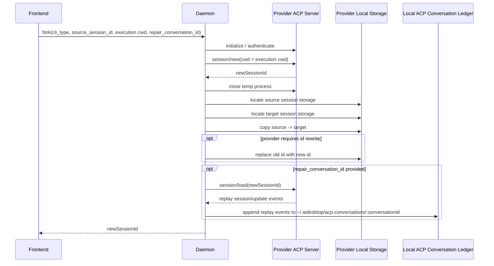
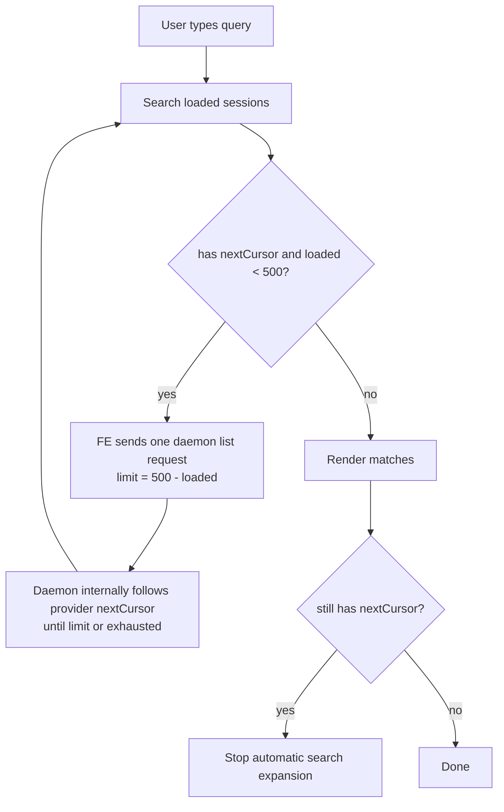
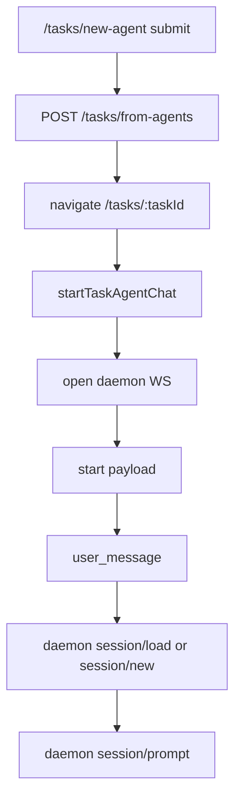
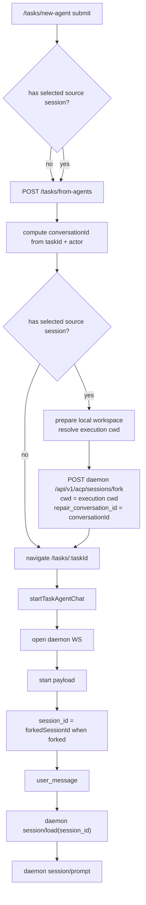

# Fork Session Implementation Plan

## 目标

在 `/tasks/new-agent` 支持 `Fork from session`：

- 用户选择一个 local ACP runtime 的历史 session。
- daemon 创建一个新的 provider session，并把 source session 的本地存储复制到新 session。
- 用户发送消息时仍走现有 free chat 流程，只是在 start payload 里带 `session_id = forkedSessionId`。

核心语义：

```text
source session = 上下文来源
selected project = 新 task 的 cwd
selected model = 新 task 使用的 model
selected runtime = 必须和 source session runtime 一致
```

---

## Step 1. Daemon Session List API

新增 daemon capability API，用于前端 picker 拉 session 列表。

建议接口：

```http
POST /api/v1/acp/sessions/list
```

请求：

```json
{
  "cli_type": "codex",
  "cursor": "optional-next-cursor"
}
```

响应：

```json
{
  "sessions": [
    {
      "sessionId": "xxx",
      "title": "调研 session 导入同步",
      "cwd": "/Users/karmiy.hong/Documents/Projects-stage-3/ai-desk",
      "updatedAt": "2026-06-29T02:45:20.000Z"
    }
  ],
  "nextCursor": "optional"
}
```

实现要点：

- daemon 只转发 provider ACP `session/list`，不做 AI Desk task 业务逻辑。
- 只有上一页 response 有 `nextCursor` 时，下一页请求才带 `cursor`。
- Cursor 当前不支持 cursor；不要无脑传 cursor。
- 第一版用全局 list，不默认按 cwd 过滤。

验证：

- Codex 返回 25 + nextCursor。
- Claude 返回约 100，无 nextCursor。
- Cursor 返回约 20，无 nextCursor，传 cursor 会报错。
- Copilot 返回约 40，无 nextCursor。

---

## Step 2. Daemon Fork Session API

新增 daemon capability API，用于创建 forked session。

建议接口：

```http
POST /api/v1/acp/sessions/fork
```

请求：

```json
{
  "cli_type": "codex",
  "source_session_id": "old-session-id",
  "cwd": "/Users/karmiy.hong/Documents/Projects-stage-3/ai-desk",
  "repair_conversation_id": "chat-task-..."
}
```

响应：

```json
{
  "session_id": "new-session-id",
  "source_session_id": "old-session-id",
  "cli_type": "codex"
}
```

内部流程：



Provider clone adapters：

| Runtime | Clone strategy |
| --- | --- |
| Codex | copy `~/.codex/sessions/.../*.jsonl`, replace old id with new id |
| Claude | copy `~/.claude/projects/.../<sessionId>.jsonl`, replace old id with new id |
| Cursor | copy `~/.cursor/acp-sessions/<sessionId>/` directory |
| Copilot | copy `~/.copilot/session-state/<sessionId>/` directory, replace old UUID with new UUID |

边界：

- fork API 默认不调用 `session/load`；只有传入 `repair_conversation_id` 时才调用 `session/load`，用于把 fork 前 replay history 写入本地 `acp-conversations` ledger。
- fork API 不调用 `session/prompt`。
- fork API 不创建 task。
- fork API 不写 cloud conversation。
- fork API 的 `cwd` 使用创建 task 后准备出的实际 local runtime execution cwd，不使用 source session cwd。对 no-project / worktree task，这个 cwd 必须和后续 `startTaskAgentChat` 使用的 workspace cwd 一致。

---

## Step 3. Frontend Session Picker

在 `/tasks/new-agent` composer toolbar 增加 `Fork from session` 入口。

未选择：

```text
[ Runtime ▾ ] [ Fork from session ] [ Mode: Agent ▾ ]
```

已选择：

```text
[ Codex ▾ ] [ 调研 session 导入同步 ▾ ] [ Mode: Agent ▾ ]
```

Picker 结构：

- 标题：`Fork from session`
- Search：`Search title, cwd, or session id...`
- Runtime tabs：`Codex / Claude / Cursor / Copilot`
- List item，不用 table：
  - title
  - cwd
  - updated date
  - action icon buttons，如 copy session id、select
- `Load more`
- `Cancel`
- `Use session`

搜索规则：



Loading UX：

- 搜索时先立即展示已加载 sessions 的匹配结果。
- 如果当前 runtime 还有 `nextCursor`，前端只发一次 bulk request，带 `limit = 500 - loaded`；daemon 内部继续请求 provider `session/list`，最多聚合到 500 条。
- 自动加载期间不要阻塞 picker，可在 list 底部展示：

```text
Searching older sessions... Loaded 325 / 500
```

- 用户继续输入新 query 时，按当前 cache 重新过滤；不要因为 query 变化在前端循环触发下一页请求。
- 到 500 条仍有 `nextCursor` 时，停止 automatic search expansion，避免前端对 daemon 进行多次 HTTP 请求。
- Codex 实测 500 条约 20 页，纯 `session/list` 约 2.9s，加 initialize 约 3.7s，因此需要可见 loading，而不是让 UI 看起来无响应。

---

## Step 4. RuntimeSelector Binding

选中 source session 后，runtime selector 必须绑定到该 session 所属 runtime。

规则：

- fork Codex session 后，只能用 Codex runtime。
- fork Claude session 后，只能用 Claude runtime。
- fork Cursor session 后，只能用 Cursor runtime。
- fork Copilot session 后，只能用 Copilot runtime。
- 清除 fork session 后，runtime selector 恢复完整可选列表。

不锁定：

- project/cwd 不锁定。用户当前选择哪个 project，fork API 和后续 chat start payload 就用哪个 cwd。
- model 不锁定。用户可以在同一 runtime 内切换 model。

建议状态：

```ts
type ForkSessionDraft = {
  sourceRuntime: "codex" | "claude" | "cursor" | "copilot";
  sourceSessionId: string;
  sourceTitle: string;
  sourceCwd?: string | null;
  sourceUpdatedAt?: string | null;
  forkedSessionId?: string | null;
};
```

RuntimeSelector 只需要支持一个 `allowedCliTypes` / `lockedCliType` 约束，不需要知道 fork 业务细节。

---

## Step 5. Free Chat Start Payload Integration

现有流程保持不变，但如果用户选择了 source session，需要在创建 task 后、导航和发送前，先准备本次 task 的 local workspace，确保拿到 `forkedSessionId`，并把 fork 前历史 repair 到 task chat 的本地 ACP conversation ledger。



加入 fork 后的实际 submit 流程：



有 fork 时只改变 start payload：

```json
{
  "type": "start",
  "cwd": "selected project cwd",
  "cli_type": "codex",
  "model": "selected model",
  "session_id": "forkedSessionId"
}
```

如果没有 fork：

- `session_id` 为空。
- daemon 仍然 `session/new`。

如果用户取消发送：

- 不创建 task。
- 不写 metadata。
- 不调用 fork API。

如果 fork API 在 submit 时失败：

- task 已创建，但不进入 `startTaskAgentChat`。
- 保留 source session 选择。
- 在 picker/composer 附近显示错误，用户可以 retry 或清除 fork 后按普通 free chat 发送。

---

## Step 6. Metadata

task metadata 继续沿用当前 runtime_state / runtime_event 回写逻辑。

建议额外记录 fork source，方便 UI 和 debug：

```json
{
  "agentChat": {
    "runtimeSelection": {},
    "session_id": "new-session-id",
    "forkSession": {
      "sourceRuntime": "codex",
      "sourceSessionId": "old-session-id",
      "sourceTitle": "调研 session 导入同步",
      "sourceCwd": "/Users/.../ai-desk"
    }
  }
}
```

注意：

- 真正执行使用的是 `session_id = new-session-id`。
- source metadata 只是审计和展示，不参与 daemon runtime routing。

---

## Step 7. Verification

Daemon focused verification：

- `session/list` 四个 runtime 都能返回 `sessionId/title/cwd/updatedAt`。
- Codex cursor pagination 正常。
- Cursor 不传 unsupported cursor。
- fork API 创建 new session id。
- fork 后 `session/load(newSessionId)` 能 replay source 历史 user/assistant 内容。
- fork API 带 `repair_conversation_id` 时，会把 fork 前 replay events 写入 `~/.aidesktop/acp-conversations/<conversationId>/`。
- fork 后 `session/prompt` 能回答 source session 的 marker。

Frontend focused verification：

- `Fork from session` button 可见。
- picker tab 切换正确。
- search 只触发一次 daemon bulk request，并由 daemon 内部聚合到最多 500 条。
- selecting session updates toolbar button label。
- selecting session locks runtime selector to source runtime。
- clearing selection restores runtime options。
- project/model change does not clear fork selection。
- submit creates task before fork, prepares the local workspace, passes the resulting execution cwd and `repair_conversation_id` to fork API, and only navigates/starts chat after fork succeeds。
- submit passes `session_id = forkedSessionId` in ACP start payload。
- no-fork free chat remains unchanged。

---

## Recommended Order

1. Daemon `session/list` endpoint.
2. Daemon provider-specific `fork` endpoint for Codex first.
3. Codex-only UI picker hidden behind local ACP runtime condition.
4. Move submit-time fork after task creation, pass `repair_conversation_id`, and wire forked session id into existing free chat start payload.
5. Add Cursor / Copilot fork adapters.
6. Add Claude fork adapter, prompt-context verification after quota recovers.
7. Polish picker search, tabs, copy id action, runtime selector lock.
8. Add regression tests and focused local smoke scripts.

这个顺序可以先用 Codex 打通端到端，避免四个 runtime adapter 和 UI 同时变化导致问题边界太大。
