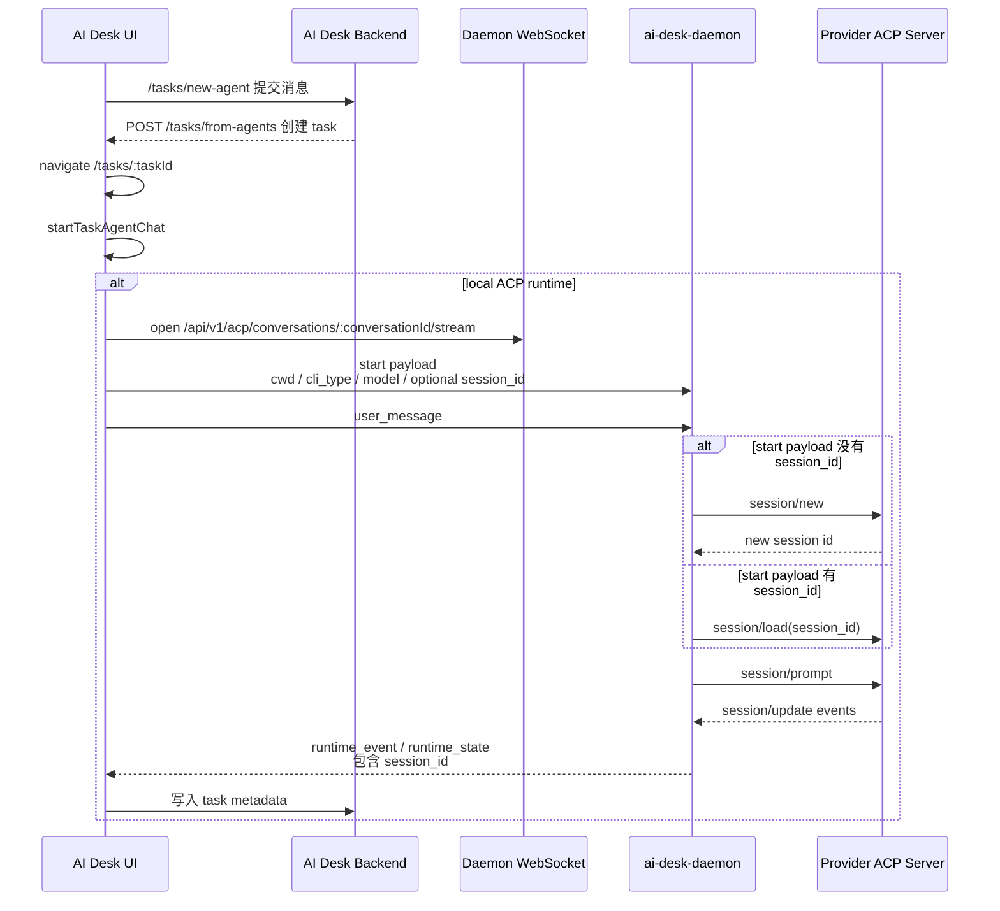
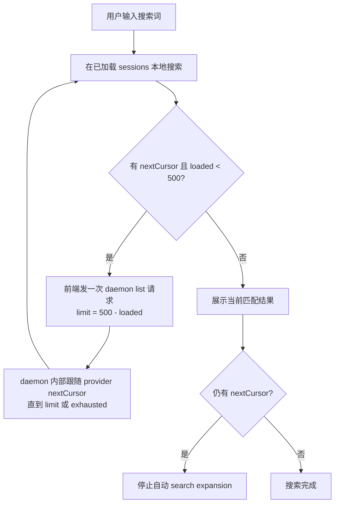
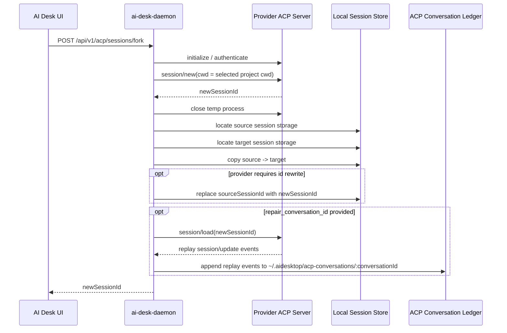
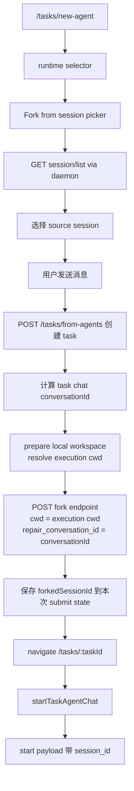

# Fork Session 方案

## 结论

`import from session` / `sync same live session` 不适合作为当前目标：

- ACP live events 只属于当前 ACP client-agent 连接，AI Desk 不能旁路订阅 Codex App / Cursor App / Claude App / Copilot App 正在进行的 live session。
- `session/load` 更像加载/恢复会话，不是订阅别的 client 的增量流。
- `session/load` 回放出来的 ACP raw event 缺少可靠 timestamp，不能用来做历史增量同步和全局排序。

可行目标是 `fork from session`：

- 用户从 runtime 暴露的 session list 里选择一个历史 session。
- daemon 创建一个新的 provider session id。
- daemon 复制旧 session 的 provider-native 本地存储到新 session 对应位置。
- 后续 AI Desk 正常用这个新 session id 建立 ACP 会话并发送消息。

---

## 当前 Free Chat 流程



现在第一次发送消息时，如果 `start payload` 没有 `session_id`，daemon 内部会 `session/new` 创建新 session，然后立刻 `session/prompt`。

---

## Fork 后工作流程

```mermaid
flowchart TD
    A["用户进入 /tasks/new-agent"] --> B["选择 local ACP runtime"]
    B --> C["打开 Fork from session 入口"]
    C --> D["daemon 调 provider session/list"]
    D --> E["UI 展示 title / cwd / updatedAt"]
    E --> F["用户选择旧 session"]
    F --> G["用户发送 free chat 消息"]
    G --> H["POST /tasks/from-agents 创建 task"]
    H --> I["FE 用 taskId / actor 算 conversationId"]
    I --> J["FE prepare local workspace<br/>拿到 execution cwd"]
    J --> K["POST daemon fork endpoint<br/>cwd = execution cwd<br/>带 repair_conversation_id"]
    K --> L["daemon 调 session/new 得到 newSessionId"]
    L --> M["daemon 关闭临时 ACP 连接"]
    M --> N["daemon 复制 old session 本地存储到 new session"]
    N --> O["daemon session/load(newSessionId)<br/>repair 到 acp-conversations"]
    O --> P["daemon 返回 newSessionId"]
    P --> Q["navigate /tasks/:taskId"]
    Q --> R["startTaskAgentChat"]
    R --> S["打开 daemon WS"]
    S --> T["start payload 带 session_id = newSessionId"]
    T --> U["daemon session/load(newSessionId)"]
    U --> V["daemon session/prompt"]
    V --> W["runtime_state / runtime_event 回传 session_id"]
    V --> W["FE 写入 task metadata"]
```

fork 的核心变化是在 free chat 发送前，多做一次 `fork session + repair local ledger` 准备，拿到新 session id，并把 fork 前历史先写入当前 task chat 的本地 `~/.aidesktop/acp-conversations/<conversationId>/`。后续 free chat 流程不变，只是 `start payload` 里带上这个新 session id。



关键点：

- fork endpoint 只做准备，不负责后续对话。
- fork endpoint 不保持 live ACP session。
- fork endpoint 在有 `repair_conversation_id` 时，会把 fork session 的 replay history 写入本地 `acp-conversations` ledger。
- 真正的 `session/load` / `session/prompt` 仍发生在现有 daemon WebSocket 流程里。
- task 创建、导航、消息发送、metadata 写入都沿用当前 free chat 流程。

---

## Session List 研究结果

四个 runtime 都能通过 `session/list` 拿到可用于选择器的数据，字段大致包括：

- `sessionId`
- `title`
- `cwd`
- `updatedAt`

分页行为不同：

| Runtime | 首次返回数量 | nextCursor | cursor 行为 |
| --- | ---: | --- | --- |
| Codex | 25 | 有 | 支持分页 |
| Claude | 100 | 无 | 传 cursor 会被忽略 |
| Cursor | 20 | 无 | 传 cursor 会报 invalid params |
| Copilot | 40 | 无 | 传 cursor 会被忽略 |

实现建议：

- 只有上一页 response 明确返回 `nextCursor`，下一次请求才带 `cursor`。
- 不要为了统一逻辑给所有 runtime 都传 cursor，Cursor 会报错。
- session 选择弹窗建议默认调用全局 `session/list {}`，不要默认传当前 cwd。
- UI 展示 `title + cwd + updatedAt`，否则用户很难判断要 fork 哪个会话。
- 如果需要按 cwd 收窄，可以作为筛选条件，而不是唯一入口。

搜索策略：



注意不要匹配到第一条就停止，因为后续页可能还有多个匹配 session。

---

## session/load 研究结果

`session/load` 适合 fork 后恢复 provider 上下文，不适合做历史同步。

不适合 import/sync 的原因：

- ACP raw event 通常只有内容，缺少可靠原始 timestamp。
- daemon 如果在 `session/load` 后临时映射成 `ACPRuntimeEvent`，timestamp 只能是当前时间。
- 这样会导致 AI Desk 里的历史事件排序混乱。
- `session/load` 也不是 subscribe/watch，不会持续监听另一个 app 的 live session。

适合 fork 的原因：

- 当 provider-native 本地 session 存储被复制到新 session id 后，`session/load(newSessionId)` 可以加载这份上下文。
- 后续 `session/prompt` 能继续利用 fork 前上下文。
- 这不是为了 UI 回放历史，而是为了让 runtime prompt context 能恢复。

---

## Fork 验证结果

| Runtime | session/new -> clone -> session/load | session/prompt 上下文验证 | 备注 |
| --- | --- | --- | --- |
| Codex | 通过 | 通过 | 复制 `~/.codex/sessions/.../*.jsonl`，替换旧 id 为新 id |
| Claude | load 通过 | 未验证 | API quota limit 阻断 prompt 复验 |
| Cursor | 通过 | 通过 | 复制 `~/.cursor/acp-sessions/<sessionId>/` 目录，不需要替换内部 id |
| Copilot | 通过 | 通过 | 复制 `~/.copilot/session-state/<sessionId>/`，替换旧 UUID 为新 UUID |

Claude 当前结论只能算 `session/load` 可行，`session/prompt` 上下文恢复还需要等 API quota 恢复后复验。

---

## Fork Endpoint 设计

建议 daemon 新增 provider-specific fork endpoint，例如：

```http
POST /api/v1/acp/sessions/fork
```

请求：

```json
{
  "cli_type": "codex",
  "cwd": "/Users/example/selected-project",
  "source_session_id": "old-session-id",
  "repair_conversation_id": "chat-task-..."
}
```

响应：

```json
{
  "session_id": "new-session-id",
  "source_session_id": "old-session-id",
  "cli_type": "codex"
}
```

内部流程：



实现边界：

- fork endpoint 默认不调用 `session/load`；只有传入 `repair_conversation_id` 时，才调用 `session/load` 做本地 ledger repair。
- fork endpoint 不调用 `session/prompt`。
- fork endpoint 不写 cloud conversation event。
- fork endpoint 不创建 task。
- fork endpoint 只返回可被后续 free chat 使用的新 provider session id。
- fork endpoint 的 `cwd` 应使用创建 task 后准备出的实际 local runtime execution cwd，而不是 source session 的旧 cwd。对 no-project / worktree task，这个 cwd 必须和后续 `startTaskAgentChat` 使用的 workspace cwd 一致。
- source session 的 cwd 只用于 picker 展示和帮助用户识别来源，不决定新 task 的执行目录。

---

## Provider Clone 策略

### Codex

存储：

```text
~/.codex/sessions/YYYY/MM/DD/rollout-*.jsonl
```

策略：

- 通过 session id 找到 source rollout jsonl。
- `session/new` 后找到 new session 对应 rollout jsonl 路径。
- 将 source jsonl 复制到 target jsonl。
- 替换文件内容里的 old session id 为 new session id。

可选增强：

- 读取 `~/.codex/state_*.sqlite` / `~/.codex/session_index.jsonl` 辅助定位 title、cwd、路径。
- 首选仍应使用 ACP `session/list`。

### Claude

存储：

```text
~/.claude/projects/<encoded-cwd>/<sessionId>.jsonl
```

策略：

- 复制 source jsonl 到 target session id 对应 jsonl。
- 替换旧 id 为新 id。
- 需要 quota 恢复后补 `session/prompt` 验证。

### Cursor

存储：

```text
~/.cursor/acp-sessions/<sessionId>/store.db
```

策略：

- 复制整个 `~/.cursor/acp-sessions/<oldSessionId>/` 到 `<newSessionId>/`。
- 实测不替换内部 id 也能 `session/load` 和 `session/prompt`。

### Copilot

存储：

```text
~/.copilot/session-state/<sessionId>/events.jsonl
```

策略：

- 复制整个 `~/.copilot/session-state/<oldSessionId>/` 到 `<newSessionId>/`。
- 替换旧 UUID 为新 UUID。

---

## Frontend 接入点

UI 侧建议流程：



pending state 可以只存在前端内存里：

- 用户选 session 时只暂存 source session draft，不立即 fork。
- 用户 submit 后先创建 task，拿到 `taskId`，准备本次 local workspace，计算 `conversationId`，再用该 workspace cwd 去 fork。
- fork 成功后，暂存本次 submit 的 `forkedSessionId`。
- 第一次发送消息时，把它作为 `session_id` 传给现有 local ACP start payload。
- 后续 daemon 会通过 `runtime_state` / `runtime_event` 把实际 session id 回传，前端继续按当前逻辑写入 task metadata。

需要注意：

- 如果用户选择了某个 source session，当前 task 的 runtime 必须绑定到这个 session 所属 runtime。
- 例如 fork Codex session 后，不能再用 Claude 创建 task；fork Cursor session 后，不能再用 Copilot 发送。
- 选中 session 后，runtime selector 应只展示或锁定该 runtime，隐藏其他 runtime 选项，避免出现跨 runtime fork。
- 如果用户主动清除 fork session，runtime selector 恢复正常。
- 用户可以继续切换 project/cwd；最终 fork endpoint 和后续 chat start payload 都使用创建 task 后准备出的同一个 execution cwd。
- 用户可以继续切换 model；后续 chat 流程按当前 model 发送，并在 runtime 支持时通过 `session/set_model` 应用。
- 如果用户取消发送，因为尚未 submit，不创建 task，也不 fork。
- 如果 submit 后 fork 失败，task 已创建但不进入 chat；UI 保留错误提示，用户可重试或清除 fork 后按普通 free chat 发送。

---

## Prototype

第一版 UI 原型采用 composer 内常驻入口：

- 未选择时按钮文案为 `Fork from session`。
- 选择后按钮文案直接替换成选中的 session title，不额外显示 tag。
- picker 顶部用项目现有 tab 风格切换 `Codex / Claude / Cursor / Copilot`。
- session list 使用 item row，不使用 table。
- item 内展示 title、cwd、updated date 和 actions icon，不重复展示 runtime tag。

![[fork-from-session-prototype-v3.png]]

---

## 风险和限制

- 这是 provider-native storage clone，不是 ACP 标准能力。
- 各 provider 存储路径和格式可能升级变化，需要版本兼容和错误提示。
- Claude 还缺一次 quota 恢复后的 prompt 上下文复验。
- 不能承诺和原 app session live sync。
- fork 后是新 session，AI Desk 和原 runtime app 不会共享同一个 live session。

建议命名上避免 `Import` / `Sync`，使用：

- `Fork from session`
- `Continue from previous session`
- `Start from existing session`

---

## 最小实现拆分

1. daemon `session/list` API
   - 转发 provider ACP `session/list`
   - 返回 `sessions + nextCursor`
   - 只在 provider 返回 `nextCursor` 时支持下一页

2. UI session picker
   - 展示 `title / cwd / updatedAt`
   - 本地搜索
   - 搜索时前端只发一次 daemon bulk list 请求，daemon 内部聚合到最多 500 条
   - 仍有 `nextCursor` 时停止自动 search expansion，避免前端多次 HTTP 请求 daemon

3. daemon fork endpoint
   - `session/new`
   - clone provider-native storage
   - 返回 new session id
   - provider-specific clone adapters

4. free chat start payload 接入
   - pending fork session id 注入现有 `optional session_id`
   - 后续流程完全复用当前 local ACP runtime chat

5. 验证
   - Codex / Cursor / Copilot：fork 后问旧上下文 marker
   - Claude：quota 恢复后补验
   - 验证普通无 fork 的 free chat 不受影响
