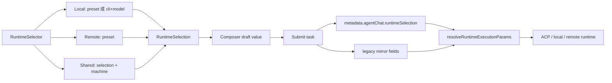
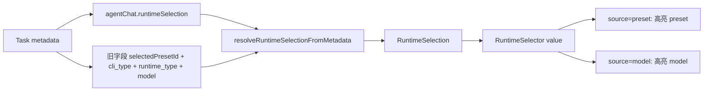
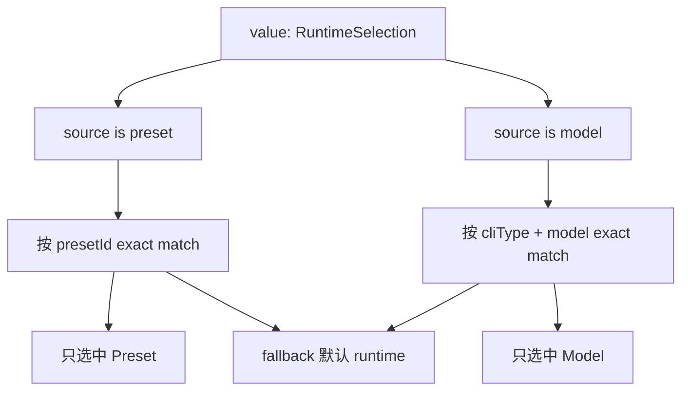
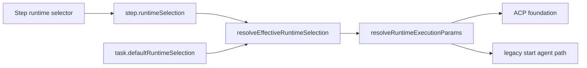
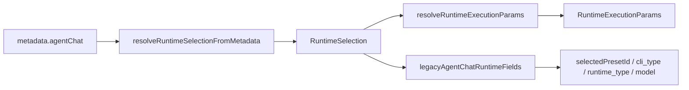

# Runtime Selector Contract

## 目标

`RuntimeSelector` 不再对外吐 `AgentPreset`，而是统一收/吐 `RuntimeSelection`。

```ts
type RuntimeSelection =
  | { type: "local"; source: "preset"; presetId: string; cliType: string; model?: string | null }
  | { type: "local"; source: "model"; presetId?: string | null; cliType: string; model: string }
  | { type: "remote"; source: "preset"; presetId: string; cliType: string; model?: string | null }
  | { type: "shared"; source: "preset" | "model"; presetId?: string | null; cliType: string; model?: string | null; sharedMachineId: string };
```

- `remote`：当前仍然来自 remote preset，`presetId` 是主引用，`cliType` 来自 `remoteCliCommand`。
- `shared`：不是单纯 preset，而是一个本地 runtime 选择加 `sharedMachineId`。
- `model`：和 `preset` 互斥。选 model 时，不因为某个 preset 的 model 相同就高亮 preset。

## 1. 新建任务选择后



提交时建议同时写：

```ts
metadata.agentChat = {
  runtimeSelection,

  // backward compatible fields
  selectedPresetId,
  selected_preset_id,
  cli_type,
  cliType,
  runtime_type,
  runtimeType,
  model,
};
```

## 2. 已有 Task 刷新后



读取顺序：

1. 优先读 `agentChat.runtimeSelection`。
2. 没有时，用旧字段组装 `RuntimeSelection`。
3. 如果旧字段只有 `selectedPresetId`，用 preset 解析出 `type / cliType / model`。
4. 如果 preset 找不到但还有 `cli_type + model`，fallback 成 `source: "model"`。

## 3. Selector 内部选中规则



关键点：`Preset` 和 `Model` 是 selection source，不是两个可同时 checked 的列表。

## 4. Flow Task / Step 选择



建议顺序：

1. Step 有自己的 `runtimeSelection` 时用 step。
2. Step 没有时用 task default。
3. Task default 没有时用用户全局默认。
4. 执行前统一解析成 `cliCommand + model + runtimeType + transport`。

## 5. 函数边界



建议函数：

```ts
resolveRuntimeSelectionFromMetadata(meta, agentStore): RuntimeSelection | null
resolveRuntimeExecutionParams(selection, agentStore): RuntimeExecutionParams
legacyAgentChatRuntimeFields(selection, params): Record<string, unknown>
runtimeSelectionFromPreset(preset): RuntimeSelection
runtimeSelectionFromCliModel(cliType, model, basePresetId?): RuntimeSelection
```

## 结论

- UI 层只表达用户选择：`RuntimeSelection`。
- Metadata 层存结构化 `runtimeSelection`，并短期保留旧字段。
- 执行层只吃解析后的 `RuntimeExecutionParams`。
- 不在 `RuntimeSelector` 内伪造 preset；如果旧 API 临时还要 `selectedPresetId`，放在 task/store adapter 层兼容。
