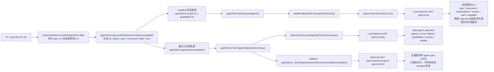
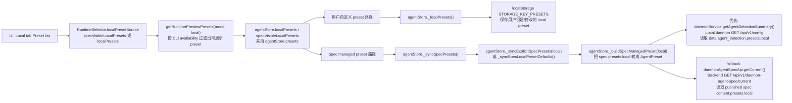
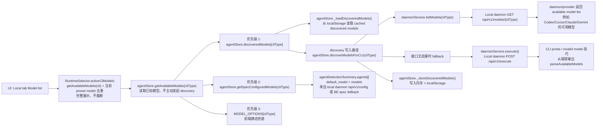
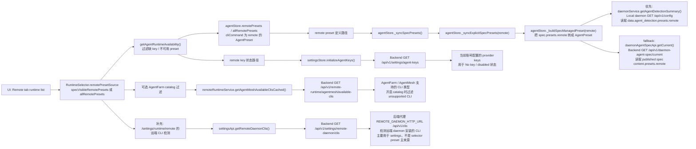
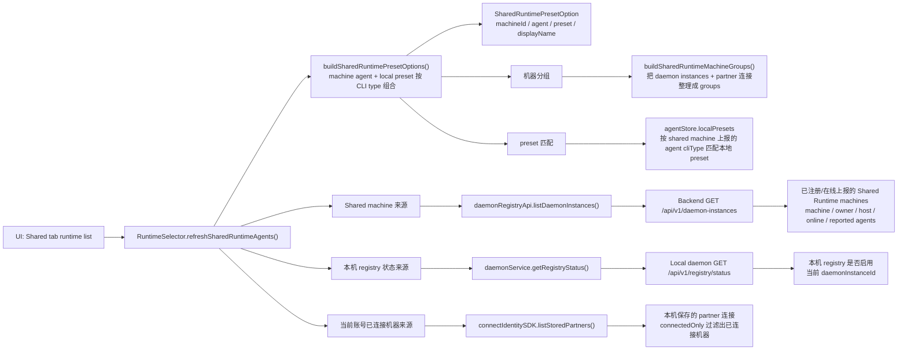

# Runtime Selector 数据来源

## Local Tab / CLI List

```mermaid
flowchart LR
  UI["UI: Local tab CLI list"]
  RT["RuntimeSelector.localCliOptionsForTabs<br/>合并 spec CLI 和本机检测 CLI"]
  GetOptions["agentStore.getLocalCliOptions(includeUnavailable)<br/>生成 CLI option: type / command / label / icon"]

  UI --> RT --> GetOptions

  GetOptions --> Installed["Installed 状态来源<br/>agentStore.localCLIs / availableCLIs"]
  Installed --> Detect["agentStore.detectLocalAgents()"]
  Detect --> Readiness["taskReadinessService.getCliDetection()"]
  Readiness --> DetectCLIs["daemonService.detectCLIs()"]
  DetectCLIs --> LocalClisAPI["Local daemon GET /api/v1/clis"]
  LocalClisAPI --> LocalClisData["本机探测 CLI<br/>type / command / displayName / version / path / available<br/>原理: daemon 查本机命令是否存在并读版本"]

  GetOptions --> Meta["展示元信息来源<br/>agentStore.agentDetectionAgents"]
  Meta --> FetchSummary["agentStore.fetchAgentDetectionSummary()"]
  FetchSummary --> DaemonSummary["daemonService.getAgentDetectionSummary()"]
  DaemonSummary --> DaemonConfig["Local daemon GET /api/v1/config"]
  DaemonConfig --> AgentDetection["data.agent_detection<br/>agents / icons / labels / capabilities / presets / models"]

  FetchSummary --> BackendFallback["fallback: agentStore._fetchAgentDetectionSummaryFromBackendSpec()"]
  BackendFallback --> BackendSpec["Backend GET /api/v1/daemon-agent-spec/current"]
  BackendSpec --> BackendSpecData["后端发布的 agent spec JSON<br/>只提供定义，不检测本机 installed 状态"]
```

## Local Tab / Preset List

```mermaid
flowchart LR
  UI["UI: Local tab Preset list"]
  Source["RuntimeSelector.localPresetSource<br/>specVisibleLocalPresets 或 localPresets"]
  Preview["getRuntimePreviewPresets(mode local)<br/>按 CLI availability 过滤出可展示 preset"]
  Presets["agentStore.localPresets / specVisibleLocalPresets<br/>来自 agentStore.presets"]

  UI --> Source --> Preview --> Presets

  Presets --> UserPresets["用户自定义 preset 路径"]
  UserPresets --> LoadPresets["agentStore._loadPresets()"]
  LoadPresets --> PresetStorage["localStorage STORAGE_KEY_PRESETS<br/>保存用户创建/修改的 local preset"]

  Presets --> SpecPresets["spec managed preset 路径"]
  SpecPresets --> SyncSpec["agentStore._syncSpecPresets()"]
  SyncSpec --> SyncLocal["agentStore._syncExplicitSpecPresets(local)<br/>或 _syncSpecLocalPresetDefaults()"]
  SyncLocal --> BuildPreset["agentStore._buildSpecManagedPreset(local)<br/>把 spec.presets.local 转成 AgentPreset"]
  BuildPreset --> DaemonPresetSpec["优先: daemonService.getAgentDetectionSummary()<br/>Local daemon GET /api/v1/config<br/>读取 data.agent_detection.presets.local"]
  BuildPreset --> BackendPresetSpec["fallback: daemonAgentSpecApi.getCurrent()<br/>Backend GET /api/v1/daemon-agent-spec/current<br/>读取 published spec content.presets.local"]
```

## Local Tab / Model List

```mermaid
flowchart LR
  UI["UI: Local tab Model list"]
  ActiveModels["RuntimeSelector.activeCliModels<br/>getAvailableModels(cli) + 当前 preset model 去重<br/>完整展示，不截断"]
  GetModels["agentStore.getAvailableModels(cliType)<br/>读取已知模型，不主动发起 discovery"]

  UI --> ActiveModels --> GetModels

  GetModels --> Discovered["优先级 1: agentStore.discoveredModels[cliType]"]
  Discovered --> LoadDiscovered["agentStore._loadDiscoveredModels()<br/>从 localStorage 读取 cached discovered models"]
  Discovered --> DiscoverPath["discovery 写入路径<br/>agentStore.discoverModelsForCLI(cliType)"]
  DiscoverPath --> ListModels["daemonService.listModels(cliType)"]
  ListModels --> ModelsAPI["Local daemon GET /api/v1/models/{cliType}"]
  ModelsAPI --> ModelsData["daemon/provider 返回 available model list<br/>例如 Codex/Cursor/Claude/Gemini 的可用模型"]
  DiscoverPath --> ProbeFallback["接口无结果时 fallback"]
  ProbeFallback --> ExecuteAPI["daemonService.execute()<br/>Local daemon POST /api/v1/execute"]
  ExecuteAPI --> ProbeData["CLI probe / invalid model 技巧<br/>从报错输出 parseAvailableModels"]
  DiscoverPath --> StoreDiscovered["agentStore._storeDiscoveredModels()<br/>写入内存 + localStorage"]

  GetModels --> SpecModels["优先级 2: agentStore.getSpecConfiguredModels(cliType)"]
  SpecModels --> AgentSpecModels["agentDetectionSummary.agents[]<br/>default_model + models<br/>来自 local daemon /api/v1/config 或 BE spec fallback"]

  GetModels --> StaticModels["优先级 3: MODEL_OPTIONS[cliType]<br/>前端静态兜底"]
```

## Remote Tab / Runtime List

```mermaid
flowchart LR
  UI["UI: Remote tab runtime list"]
  Source["RuntimeSelector.remotePresetSource<br/>specVisibleRemotePresets 或 allRemotePresets"]
  Availability["getAgentRuntimeAvailability()<br/>过滤缺 key / 不可用 preset"]
  RemotePresets["agentStore.remotePresets / allRemotePresets<br/>cliCommand 为 remote 的 AgentPreset"]

  UI --> Source --> Availability --> RemotePresets

  RemotePresets --> SpecPresetPath["remote preset 定义路径"]
  SpecPresetPath --> SyncSpec["agentStore._syncSpecPresets()"]
  SyncSpec --> SyncRemote["agentStore._syncExplicitSpecPresets(remote)"]
  SyncRemote --> BuildRemote["agentStore._buildSpecManagedPreset(remote)<br/>把 spec.presets.remote 转成 AgentPreset"]
  BuildRemote --> DaemonRemoteSpec["优先: daemonService.getAgentDetectionSummary()<br/>Local daemon GET /api/v1/config<br/>读取 data.agent_detection.presets.remote"]
  BuildRemote --> BackendRemoteSpec["fallback: daemonAgentSpecApi.getCurrent()<br/>Backend GET /api/v1/daemon-agent-spec/current<br/>读取 published spec content.presets.remote"]

  Availability --> KeyPath["remote key 状态路径"]
  KeyPath --> InitKeys["settingsStore.initializeAgentKeys()"]
  InitKeys --> AgentKeysAPI["Backend GET /api/v1/settings/agent-keys"]
  AgentKeysAPI --> AgentKeysData["当前账号配置的 provider keys<br/>用于 No key / disabled 状态"]

  Source --> AgentFarmPath["可选 AgentFarm catalog 过滤"]
  AgentFarmPath --> AgentFarmFn["remoteRuntimeService.getAgentMeshAvailableClisCached()"]
  AgentFarmFn --> AgentFarmAPI["Backend GET /api/v1/remote-runtime/agentmesh/available-clis"]
  AgentFarmAPI --> AgentFarmData["AgentFarm / AgentMesh 支持的 CLI 类型<br/>开启 catalog 时过滤 unsupported CLI"]

  Source --> RemoteDaemonNote["补充: /settings/runtime/remote 的远端 CLI 检测"]
  RemoteDaemonNote --> RemoteDaemonFn["settingsApi.getRemoteDaemonClis()"]
  RemoteDaemonFn --> RemoteDaemonAPI["Backend GET /api/v1/settings/remote-daemon/clis"]
  RemoteDaemonAPI --> RemoteDaemonData["后端代理 REMOTE_DAEMON_HTTP_URL /api/v1/clis<br/>检测远端 daemon 安装的 CLI<br/>主要用于 settings，不是 selector preset 主来源"]
```

## Shared Tab / Runtime List

```mermaid
flowchart LR
  UI["UI: Shared tab runtime list"]
  Refresh["RuntimeSelector.refreshSharedRuntimeAgents()"]
  BuildOptions["buildSharedRuntimePresetOptions()<br/>machine agent + local preset 按 CLI type 组合"]
  SharedOptions["SharedRuntimePresetOption<br/>machineId / agent / preset / displayName"]

  UI --> Refresh --> BuildOptions --> SharedOptions

  Refresh --> InstancesPath["Shared machine 来源"]
  InstancesPath --> ListInstances["daemonRegistryApi.listDaemonInstances()"]
  ListInstances --> InstancesAPI["Backend GET /api/v1/daemon-instances"]
  InstancesAPI --> InstancesData["已注册/在线上报的 Shared Runtime machines<br/>machine / owner / host / online / reported agents"]

  Refresh --> RegistryPath["本机 registry 状态来源"]
  RegistryPath --> RegistryStatus["daemonService.getRegistryStatus()"]
  RegistryStatus --> RegistryAPI["Local daemon GET /api/v1/registry/status"]
  RegistryAPI --> RegistryData["本机 registry 是否启用<br/>当前 daemonInstanceId"]

  Refresh --> PartnerPath["当前账号已连接机器来源"]
  PartnerPath --> Partners["connectIdentitySDK.listStoredPartners()"]
  Partners --> PartnerData["本机保存的 partner 连接<br/>connectedOnly 过滤出已连接机器"]

  BuildOptions --> GroupPath["机器分组"]
  GroupPath --> Groups["buildSharedRuntimeMachineGroups()<br/>把 daemon instances + partner 连接整理成 groups"]
  BuildOptions --> PresetMatch["preset 匹配"]
  PresetMatch --> LocalPresets["agentStore.localPresets<br/>按 shared machine 上报的 agent cliType 匹配本地 preset"]
```
