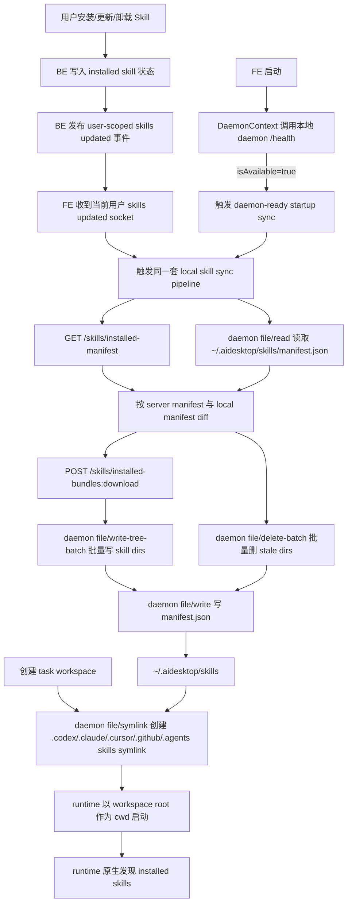

# 00 总览：AI Desk Installed Skill Native Discovery

更新时间：2026-07-09

## 背景

当前 AI Desk installed skill 主要依赖 slash 选择后拼接 runtime prompt，再让 runtime 通过 MCP 拉取 skill 内容。这个方式能覆盖显式选择，但不符合主流 runtime skill 的使用方式：runtime 应该能在启动时看到可用 skill 的 `name`、`description`、`SKILL.md`，再根据用户自然语言意图自动选择。

本方案将用户已安装的 AI Desk skills 物化到本机固定目录，并在每个 task workspace 外层创建 runtime 原生 skills 目录的 symlink，让 Codex、Claude Code、Cursor、GitHub Copilot 等 runtime 按各自原生规则发现这些 skills。

## 目标

- 用户说“请使用 bug-analysis 这个 skill 帮我分析...”时，runtime 能发现并使用该 installed skill。
- 用户只说“帮我分析一下这个 bug”时，runtime 能基于已暴露 skill 的 `name` / `description` 自动选择合适 skill。
- 一个 skill 的 `SKILL.md` 里提到另一个已安装 skill 时，runtime 能在同一个 skills inventory 中继续发现。
- 现有 slash 选择仍走 MCP `get_platform_entities(kind='skill')`，但 runtime 会优先使用 workspace 中已物化的同名 skill。
- 用户在 AI Desk 更新 installed skill 后，本地 `~/.aidesktop/skills` 能通过 sync 收敛到最新状态。

## 总体方案



## 关键设计

### 1. 本地用户级 inventory

所有 installed skills 物化到：

```text
~/.aidesktop/skills/
  manifest.json
  bug-analysis/
    SKILL.md
    references/
    scripts/
```

`manifest.json` 记录本地物化结果和 daemon 写入/删除失败项。

### 2. Task workspace 只做目录级 symlink

每个 task workspace 外层创建：

```text
.codex/skills  -> ~/.aidesktop/skills
.claude/skills -> ~/.aidesktop/skills
.cursor/skills -> ~/.aidesktop/skills
.github/skills -> ~/.aidesktop/skills
.agents/skills -> ~/.aidesktop/skills
```

Runtime-visible skill 目录为 `~/.aidesktop/skills/{dirName}`。

### 3. Sync 由 FE 编排

FE 是 sync 编排者：

- 调 BE business API 获取 installed manifest / bundle。
- 调 daemon generic batch file APIs 批量写 skill dirs、批量删 stale dirs，并最后写 `manifest.json`。
- 监听 daemon-ready startup 和 BE skill change socket。

## 规格文件说明

- 阅读顺序：先读 `00-overview.md` 理解端到端流程，再读 `04-implementation-plan.md` 执行实现；中间三个文件是具体契约。
- `01-local-materialization.md`：本地目录、manifest、dirName normalize、bundle 写入规则。
- `02-sync-flow.md`：FE/BE/daemon sync 流程、API 契约、socket 触发。
- `03-workspace-runtime-discovery.md`：task workspace symlink、runtime discovery。
- `04-implementation-plan.md`：按模块实现顺序、测试、验收和风险。
