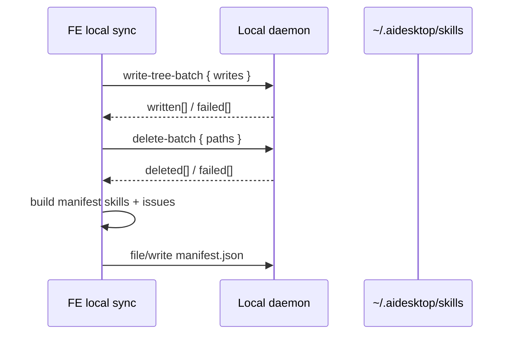

# 01 本地物化方案

更新时间：2026-07-09

## 目标

定义 installed skill 在用户机器上的最终落盘结构、manifest、目录命名、bundle 写入和删除规则。AI 实现时应优先按本文件完成本地数据模型和 daemon 文件操作。

## 本地目录结构

```text
~/.aidesktop/skills/
  manifest.json
  bug-analysis/
    SKILL.md
    references/
      workflow.md
    scripts/
      helper.js
  code-review/
    SKILL.md
```

规则：

- `~/.aidesktop/skills` 是用户级 installed skills inventory。
- local sync 必须确保 `~/.aidesktop/skills` 存在。
- root 创建通过 `POST /api/v1/file/write` 写 `~/.aidesktop/skills/manifest.json` 完成；daemon `file/write` 会创建 parent directory。
- 每个 skill 使用稳定目录：`~/.aidesktop/skills/{dirName}`。
- `dirName` 由 BE manifest 返回的 raw `name` normalize 得到。
- Runtime-visible 目录层级为 `~/.aidesktop/skills/{dirName}`。
- `SKILL.md` 和 supporting files 按 BE bundle 写入。
- `manifest.json` 位于 `~/.aidesktop/skills/manifest.json`。

## dirName 规则

```text
dirName = normalizeSkillDirName(skill.name)
```

Normalize 规则：

- trim raw name。
- 将 path separator 和目录不安全字符转换为 `-`。
- 连续 `-` 折叠为一个。
- 去掉首尾 `-` / `.`。
- normalize 后仍为空时跳过该 entry 的 write。

示例：

| Raw name | dirName | 行为 |
| --- | --- | --- |
| `bug-analysis` | `bug-analysis` | 正常写入 |
| `a/b` | `a-b` | 正常写入 |
| `a:b` | `a-b` | 正常写入 |
| `a\b` | `a-b` | 正常写入 |
| `///` | empty | 跳过 write |

重复规则：

- FE 按 server manifest 顺序生成 batch writes。
- 多个 write 指向同一个 `dirName` 时，daemon 按请求顺序执行，后写入的 item 通过 `replace=true` 覆盖前一个目录。

## Local Manifest

路径：

```text
~/.aidesktop/skills/manifest.json
```

Schema：

```ts
type LocalSkillSyncTrigger =
  | 'daemon_ready_startup'
  | 'skill_change_socket'
  | 'manual';

type LocalSkillRecord = {
  id: string;
  name: string;
  version: string;
  dirName: string;
  sourceUpdatedAt?: string;
  materializedAt: string;
};

type LocalSkillIssue = {
  category: 'write_failed' | 'delete_failed';
  type:
    | 'skill_directory_write_failed'
    | 'stale_directory_delete_failed';
  id?: string;
  name?: string;
  dirName?: string;
  path?: string;
  operation?: 'write' | 'delete';
  code?: string;
  detectedAt: string;
  message: string;
};

type LocalSkillsManifest = {
  schemaVersion: 1;
  kind: 'aidesk.installedSkills.localManifest';
  root: '~/.aidesktop/skills';
  lastSyncedAt: string;
  lastSyncTrigger: LocalSkillSyncTrigger;
  skills: LocalSkillRecord[];
  issues: LocalSkillIssue[];
};
```

示例：

```json
{
  "schemaVersion": 1,
  "kind": "aidesk.installedSkills.localManifest",
  "root": "~/.aidesktop/skills",
  "lastSyncedAt": "2026-07-09T09:20:00Z",
  "lastSyncTrigger": "daemon_ready_startup",
  "skills": [
    {
      "id": "6f2a9c1e-0000-4000-8000-000000000001",
      "name": "bug-analysis",
      "version": "1.3.0",
      "dirName": "bug-analysis",
      "sourceUpdatedAt": "2026-07-09T09:18:30Z",
      "materializedAt": "2026-07-09T09:20:00Z"
    }
  ],
  "issues": []
}
```

Manifest 写入规则：

- 缺失、invalid JSON、unsupported schema 按 empty manifest 处理。
- server manifest 为空时也要写入 `manifest.json`，用于创建并保留 `~/.aidesktop/skills` root。
- 只有对应 skill directory 写入成功后，才能更新该 skill record。
- manifest `skills` 记录当前已知成功物化且仍需要保留的 skill records。
- manifest `issues` 只记录本轮 daemon 写入失败和删除失败；下一轮 sync 不读取旧 `issues` 参与 diff。
- BE manifest / bundle download 失败时保留当前 manifest。
- 批量写或批量删存在部分失败时仍写 manifest，`issues` 只记录 daemon 写入失败和删除失败。
- 删除 stale directory 只删除旧 manifest 记录过的 `dirName`，不扫描删除未知目录。

## Bundle 写入规则

BE bundle response 中每个 skill 包含：

```json
{
  "id": "6f2a9c1e-0000-4000-8000-000000000001",
  "name": "bug-analysis",
  "version": "1.3.0",
  "files": {
    "SKILL.md": "...",
    "references/workflow.md": "...",
    "scripts/helper.js": "..."
  }
}
```

FE 将其写到：

```text
~/.aidesktop/skills/{dirName}
```

每轮 sync 先完成 diff 和 bundle download，再调用 daemon batch 写入接口；stale directory 通过 daemon batch 删除接口处理；最后 FE 单独写 `manifest.json`。

文件路径规则：

- `files` 的 key 必须是相对路径。
- 拒绝 absolute path、空 path、`..`、path escape。
- Windows separator `\` 按路径 separator 处理，并解析到 root 内路径。
- bundle 必须包含 `SKILL.md`。

## Batch Write / Delete

Sync 使用两个 daemon generic file batch API 处理目录变更。

```http
POST /api/v1/file/write-tree-batch
```

Request 示例：

```json
{
  "root": "~/.aidesktop/skills",
  "writes": [
    {
      "relative_path": "bug-analysis",
      "replace": true,
      "files": {
        "SKILL.md": "---\nname: bug-analysis\n---\n...",
        "references/workflow.md": "# Workflow\n"
      }
    }
  ],
  "continue_on_error": true
}
```

Response 示例：

```json
{
  "success": true,
  "data": {
    "written": [
      {
        "relative_path": "bug-analysis",
        "status": "written"
      }
    ],
    "failed": [
      {
        "relative_path": "code-review",
        "code": "permission_denied",
        "message": "Cannot write target directory"
      }
    ]
  }
}
```

```http
POST /api/v1/file/delete-batch
```

Request 示例：

```json
{
  "root": "~/.aidesktop/skills",
  "paths": [
    "old-bug-analysis"
  ],
  "recursive": true,
  "continue_on_error": true
}
```

Response 示例：

```json
{
  "success": true,
  "data": {
    "deleted": [
      {
        "relative_path": "old-bug-analysis",
        "status": "deleted"
      }
    ],
    "failed": [
      {
        "relative_path": "old-code-review",
        "code": "permission_denied",
        "message": "Cannot delete target directory"
      }
    ]
  }
}
```

字段规则：

- `root` 必须在 daemon `allowed_working_dirs` 下。
- `writes[].relative_path`、`paths[]` 和 `writes[].files` key 都必须是相对路径。
- 拒绝 absolute path、空 path、`..`、path escape。
- `writes[].replace` 复用现有 `/file/write-tree` 的 replace 语义；local skill sync 传 `replace=true`，替换整个 `~/.aidesktop/skills/{dirName}` skill directory。
- `continue_on_error=true` 时，daemon 尽可能执行其他 item，并在 response 返回 per-item failure。
- FE 汇总写入、删除结果后，单独调用 `POST /api/v1/file/write` 写 `~/.aidesktop/skills/manifest.json`。

Sync 写入流程：



失败处理：

- write-tree-batch 某个 item 失败：add 失败不新增 local `skills` record，update/move 失败保留旧 record，失败写入本轮 `issues`。
- delete-batch 某个 item 失败：保留旧 local record，失败写入本轮 `issues`。
- manifest write 失败：本轮目录变更可能已发生，但旧 manifest 保留；下轮 sync 基于保留下来的 manifest 重新 diff。
- BE manifest / bundle download 失败：结束本轮 sync，保留当前 manifest。

首轮安装 100 个 skills 时，FE 执行一次 manifest diff、一次 bundle download、一次 `write-tree-batch`。

删除规则：

- uninstall、server manifest 缺失、rename 后旧 `dirName` 都需要删除旧 manifest 记录的目录。
- 删除通过 `delete-batch.paths` 提交。
- 删除范围来自旧 manifest 记录过的 `dirName`。

## Daemon API 使用

| API                                  | 状态   | 本方案用途                                                                                           |
| ------------------------------------ | ---- | ----------------------------------------------------------------------------------------------- |
| `GET /health`                        | 已有   | FE 确认 daemon ready 后才开始 local sync。                                                             |
| `POST /api/v1/file/read`             | 已有   | 读取 local manifest。                                                                              |
| `POST /api/v1/file/stat`             | 已有   | sync / workspace symlink 前确认 `~/.aidesktop/skills` root 或 link path。 |
| `POST /api/v1/file/write-tree-batch` | 需要新增 | 批量写入或替换 skill dirs，返回 per-item result；内部复用现有 `writeFileTree` / `/file/write-tree` 语义。           |
| `POST /api/v1/file/delete-batch`     | 需要新增 | 批量删除 stale dirs，返回 per-item result。                                                             |
| `POST /api/v1/file/write`            | 已有   | FE 最后写 `manifest.json`。                                                                         |
| `POST /api/v1/file/symlink`          | 已有   | task workspace 外层创建 provider skills symlink。                                                       |
