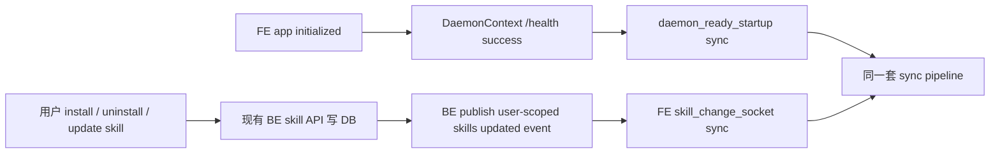
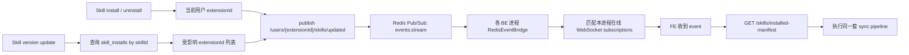
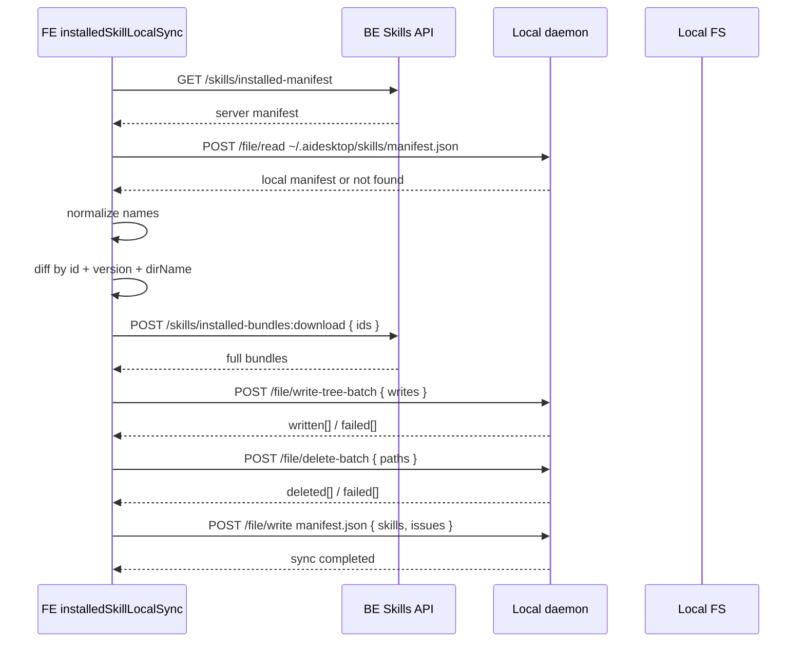

# 02 Sync 流程与接口方案

更新时间：2026-07-09

## 目标

定义 local skill sync 如何被触发、如何从 BE 拉取最终状态、如何与本地 manifest diff、如何下载并写入 bundle，以及 BE 如何在 installed skill 变化后通知 FE。

## Sync 触发源



触发规则：

- `daemon_ready_startup`：FE app initialized 后，`DaemonContext` 调本地 daemon `/health` 成功，`isAvailable=true`。
- `skill_change_socket`：FE 收到 BE `/users/{extensionId}/skills/updated` 事件后触发。
- sync service 必须 single-flight：同一时间只有一个 sync 正在执行；新触发合并到下一轮或复用当前 promise。

## BE API Inventory

| API / Event | 状态 | 调用方 | 用途 |
| --- | --- | --- | --- |
| `POST /api/v1/skills/{skillId}/install` | 已有，需补事件发送 | FE Settings skills | install 成功后发布当前用户 `/users/{extensionId}/skills/updated`。 |
| `DELETE /api/v1/skills/{skillId}/install` | 已有，需补事件发送 | FE Settings skills | uninstall 成功后发布当前用户 `/users/{extensionId}/skills/updated`。 |
| `PUT /api/v1/skills/{skillId}` / import sync endpoints | 已有，需补事件发送 | FE Settings skills | version update 成功后发布安装用户 `/users/{extensionId}/skills/updated`。 |
| `GET /api/v1/skills/installed-manifest` | 需要新增 | FE local sync service | 拉取当前用户 installed skills 的轻量 manifest。 |
| `POST /api/v1/skills/installed-bundles:download` | 需要新增 | FE local sync service | 下载需要写入的 skill bundle。 |
| `POST /api/v1/events/subscriptions` | 已有，需补用户路径校验 | FE event bus | 订阅 `/users/{extensionId}/skills/updated` 时校验只能订阅当前用户。 |
| Event pattern `/users/~/skills/updated` | 需要新增 registry pattern | BE -> FE event bus | 通知指定用户的在线 FE 重新拉 manifest。 |

## BE Installed Manifest API

Endpoint：

```http
GET /api/v1/skills/installed-manifest
```

Response：

```json
{
  "success": true,
  "data": {
    "generatedAt": "2026-07-09T09:20:00Z",
    "skills": [
      {
        "id": "6f2a9c1e-0000-4000-8000-000000000001",
        "name": "bug-analysis",
        "version": "1.3.0",
        "description": "Analyze a bug and identify root cause.",
        "updatedAt": "2026-07-09T09:18:30Z"
      }
    ]
  }
}
```

字段：

- `id`、`name`、`version` 必填。
- `description`、`updatedAt` 随 manifest 返回。
- skill 内容或 `name` 改变时，`version` 必须变化。

## BE Bundle Download API

Endpoint：

```http
POST /api/v1/skills/installed-bundles:download
Content-Type: application/json
```

Request：

```json
{
  "ids": [
    "6f2a9c1e-0000-4000-8000-000000000001"
  ]
}
```

Response：

```json
{
  "success": true,
  "data": {
    "skills": [
      {
        "id": "6f2a9c1e-0000-4000-8000-000000000001",
        "name": "bug-analysis",
        "version": "1.3.0",
        "description": "Analyze a bug and identify root cause.",
        "updatedAt": "2026-07-09T09:18:30Z",
        "files": {
          "SKILL.md": "---\nname: bug-analysis\ndescription: Analyze a bug and identify root cause.\n---\n...",
          "references/workflow.md": "# Workflow\n"
        }
      }
    ]
  }
}
```

规则：

- FE 只请求 `writeSet` 中的 ids。
- BE 必须校验请求 id 是当前用户 installed skill。
- BE 按请求 ids 返回当前最新 skill bundle。
- `SKILL.md` 必须存在；如果 persisted files 没有 `SKILL.md` 但 skill content 存在，BE 复用现有逻辑合成 `SKILL.md`。
- Supporting file path 必须是安全相对路径。
- missing、deleted、unauthorized skill 返回受控错误。

## BE Skills Updated Event

新增 event pattern：

```text
/users/~/skills/updated
```

加入 `backend/app/events/pattern_registry.py`，`params=["extensionId"]`，permission 使用 `settings:read`。

Payload：

```json
{
  "type": "install",
  "skillId": "6f2a9c1e-0000-4000-8000-000000000001",
  "version": "1.3.0",
  "emittedAt": "2026-07-09T09:20:00Z"
}
```

Type：

```text
install | uninstall | version
```

事件规则：

- FE 只订阅当前登录用户自己的 `/users/{extensionId}/skills/updated`。
- BE subscription API 对该 pattern 校验 `params.extensionId == current_user.rc_extension_id`。
- install 成功后，BE publish 到当前用户的 resolved pattern。
- uninstall 成功后，BE publish 到当前用户的 resolved pattern。
- version update 成功后，BE 查询 `skill_installs` 中安装该 skill 的用户，并分别 publish 到这些用户的 resolved pattern。
- FE 收到事件后重新调用 `GET /skills/installed-manifest`。
- 重复、乱序、过期事件都通过 manifest diff 收敛。

派发链路：



## Sync Pipeline



`POST /file/write manifest.json` 必须在本轮 sync 成功走到 manifest 写入阶段时执行；server manifest 为空、`writeSet` 为空、`deleteSet` 为空时也要写入。该写入会创建 `~/.aidesktop/skills` parent directory。

Diff algorithm：

1. 读取 local manifest：
   - missing：按 empty manifest。
   - invalid JSON / unsupported schema：按 empty manifest。
   - valid：按 `skills[].id` 建 index。
   - `issues` 不参与 diff，每轮 sync 都重新生成本轮 `issues`。
2. 规范化 server entries：
   - `id` 是稳定身份。
   - `version` 是内容身份。
   - `name` 是 BE raw skill name。
   - `dirName = normalizeSkillDirName(name)` 是 runtime-visible directory。
   - duplicate raw name 或 duplicate normalized `dirName` 按 server manifest 顺序生成 writes。
3. 生成 `writeSet`：
   - 对每个 server entry，找到同 id 的 local record。
   - local record 不存在，或 `version` / `dirName` 任一不同，则加入 `writeSet`。
   - local record 存在且 `version`、`dirName` 都相同，则不写。
4. 生成 `deleteSet`：
   - local manifest 中存在但 server manifest 不存在的 id，删除旧 record 的 `dirName`。
   - 同 id 进入 `writeSet` 且旧 `dirName` 与新 `dirName` 不同，写入新目录成功后删除旧 `dirName`。
   - server entry normalize 后没有有效 `dirName` 时，如果 local manifest 有旧 `dirName`，删除旧 record 的 `dirName`。
5. 下载 `writeSet` 中 ids 的 bundles。
6. 调 daemon `write-tree-batch` 写 `writeSet` 的完整 skill directory，所有 item 使用 `replace=true`。
7. 调 daemon `delete-batch` 删除 `deleteSet`。
8. 根据 batch response 构建下一版 local manifest：
   - `writeSet` 写入成功的 entry 写入或更新 `skills`。
   - `writeSet` 写入失败的 entry 写入本轮 `issues`；local 已有旧 record 时保留旧 record，local 没有旧 record 时不新增 record。
   - `deleteSet` 删除成功的旧 record 从 `skills` 移除。
   - `deleteSet` 删除失败的旧 record 保留在 `skills`，失败项写入本轮 `issues`。
9. 调 daemon `file/write` 写 `manifest.json`。

## 失败处理

- BE manifest 拉取失败：结束本轮 sync，保留当前本地文件。
- local manifest 读取发生 IO / permission 错误：本轮 sync 失败。
- bundle download 部分失败：结束本轮 sync，保留当前 manifest。
- write-tree-batch 部分失败：成功项进入 manifest `skills`，失败项进入本轮 `issues`；失败项未进入新 record 时，下轮会因 server manifest 有、local manifest 无而重新写入。
- delete-batch 部分失败：失败项进入本轮 `issues`，旧 record 保留；下轮会因 server manifest 无、local manifest 有而继续删除。
- manifest write 失败：保留已完成的 batch 操作，下轮基于保留下来的 manifest 重新 diff。

## 可观测性

FE structured logs / metrics：

| Event | Fields |
| --- | --- |
| `skill_sync.start` | `trigger` |
| `skill_sync.manifest_fetched` | `skillCount` |
| `skill_sync.local_manifest_read` | `status`, `skillCount` |
| `skill_sync.diff` | `writeCount`, `deleteCount`, `noopCount` |
| `skill_sync.bundle_download` | `requestedCount`, `downloadedCount`, `durationMs`, `result` |
| `skill_sync.batch_write` | `writeCount`, `failedCount`, `durationMs`, `result` |
| `skill_sync.batch_delete` | `deleteCount`, `failedCount`, `durationMs`, `result` |
| `skill_sync.skill_written` | `skillId`, `name`, `dirName`, `version`, `result` |
| `skill_sync.stale_deleted` | `skillId`, `name`, `dirName`, `result` |
| `skill_sync.complete` | `status`, `durationMs` |

BE structured logs：

- installed manifest returned
- bundle download requested / completed / rejected
- skill change event published
- skills updated event published
