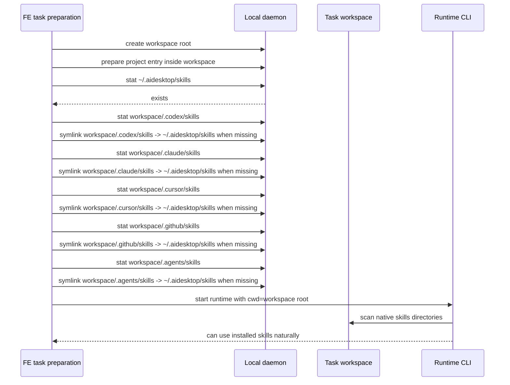

# 03 Task Workspace 与 Runtime Discovery

更新时间：2026-07-09

## 目标

定义 task 创建后如何把 `~/.aidesktop/skills` 暴露给 runtime 原生 skill discovery。

## Workspace 结构

AI Desk task 运行在 AI Desk 管理的 workspace 外层目录。provider skills symlink 创建在 workspace 外层目录。

```text
~/.aidesktop/workspace-7f3a9/
  .codex/skills  -> ~/.aidesktop/skills
  .claude/skills -> ~/.aidesktop/skills
  .cursor/skills -> ~/.aidesktop/skills
  .github/skills -> ~/.aidesktop/skills
  .agents/skills -> ~/.aidesktop/skills
  FIJI/           # task project entry
```

项目入口规则：

- `FIJI/` 是 task 的项目入口，可以是 AI Desk 创建的 checkout，也可以是指向真实项目路径的 symlink。
- Provider skills symlink 与 `FIJI/` 同级。
- local runtime CLI 启动 cwd 为 workspace 外层目录或等价 provider runtime root。

## 执行时机与顺序

Provider skills symlink 在 FE 的 task workspace preparation 阶段执行，顺序位于 workspace 外层目录和项目入口准备完成之后、runtime CLI 启动之前。

执行顺序：

1. FE 完成 task 创建所需的 BE business API 调用。
2. FE 通过 daemon 创建 workspace 外层目录。
3. FE 完成 task project entry 准备：
   - worktree 场景：项目 checkout / worktree 位于 workspace 内。
   - no-worktree 场景：`workspace/{projectName}` symlink 指向真实项目路径。
4. FE 确认 `~/.aidesktop/skills` 存在；不存在时触发 local skill sync。
5. FE 在 workspace 外层创建 provider skills symlink。
6. FE 启动 local runtime CLI，cwd 使用 workspace 外层目录。

## Runtime Discovery Flow



## Provider Skills Symlinks

必须确保以下 link：

| Link path | Target |
| --- | --- |
| `{workspaceRoot}/.codex/skills` | `~/.aidesktop/skills` |
| `{workspaceRoot}/.claude/skills` | `~/.aidesktop/skills` |
| `{workspaceRoot}/.cursor/skills` | `~/.aidesktop/skills` |
| `{workspaceRoot}/.github/skills` | `~/.aidesktop/skills` |
| `{workspaceRoot}/.agents/skills` | `~/.aidesktop/skills` |

## Provider Skills Symlink API

复用已有 daemon API：

```http
POST /api/v1/file/symlink
Content-Type: application/json
```

Request：

```json
{
  "link_path": "~/.aidesktop/workspace-7f3a9/.codex/skills",
  "target_path": "~/.aidesktop/skills"
}
```

Response：

```json
{
  "success": true,
  "data": {
    "link_path": "/Users/me/.aidesktop/workspace-7f3a9/.codex/skills",
    "target_path": "/Users/me/.aidesktop/skills",
    "created": true
  }
}
```

Task preparation 执行规则：

- 先 `file/stat` 确认 `~/.aidesktop/skills` 存在。
- root 不存在时先触发 local sync；local sync 会写 `manifest.json` 并创建 root。
- 对每个 provider link path 先 `file/stat`。
- link path 不存在时调用 `/api/v1/file/symlink` 创建。
- link path 已存在且是 directory 时按 no-op 处理；workspace 外层由 AI Desk 创建，重复 task preparation 不需要重建同一路径。
- link path 已存在且不是 directory 时阻断 runtime start。
- `/api/v1/file/symlink` 返回 conflict 时，FE 重新 `file/stat`：如果已是 directory，按 no-op；否则按 conflict 处理。
- link path 或 target 不在 daemon `allowed_working_dirs` 时返回错误。

## 显式 MCP 选择兼容

现有 slash 选择保持原样：FE 继续插入 `get_platform_entities(id='...', kind='skill')` 指令，不新增前端 formatter 逻辑。

BE 在 `get_platform_entities(kind='skill')` 返回的 `agentInstructions` 中补充 workspace native skill 优先级。新的第二条 instruction：

```text
You MUST first check whether the current workspace already has this Skill under .{agent}/skills. If it exists, use that workspace Skill cache and do NOT download materialization.archiveUrl.
```

原有 materialization cache/download instruction 需要改成：

```text
If no workspace Skill cache exists, you MUST check whether materialization.targetDir already exists. If it exists, use the cached files there and do NOT download materialization.archiveUrl. If it does not exist, you MUST download materialization.archiveUrl and extract the zip into materialization.targetDir before using this Skill.
```

执行效果：

- runtime 已在当前 workspace 的 provider skills directory 看到同名 skill 时，直接使用 workspace native skill。
- workspace native skill 不存在时，继续执行现有 `materialization.targetDir` / `archiveUrl` 缓存逻辑。
- FE slash UI、chip、prompt marker 不需要改动。

## Runtime 验收场景

| 场景 | 期望 |
| --- | --- |
| 用户说“使用 bug-analysis 这个 skill...” | runtime 在 workspace skills 中找到 `bug-analysis/SKILL.md`。 |
| 用户说“帮我分析这个 bug” | runtime 可基于 `bug-analysis` 的 name/description 自动选择。 |
| `bug-analysis/SKILL.md` 引用 `code-review` | runtime 可在同一 inventory 发现 `code-review`。 |
| skill 更新后新 runtime session 启动 | 读取 `~/.aidesktop/skills/{dirName}` 最新内容。 |
| workspace symlink | provider skills symlink 位于 workspace 外层。 |
| slash 显式选择 skill | `get_platform_entities(kind='skill')` 返回的 instructions 让 runtime 优先读取 workspace native skill。 |
