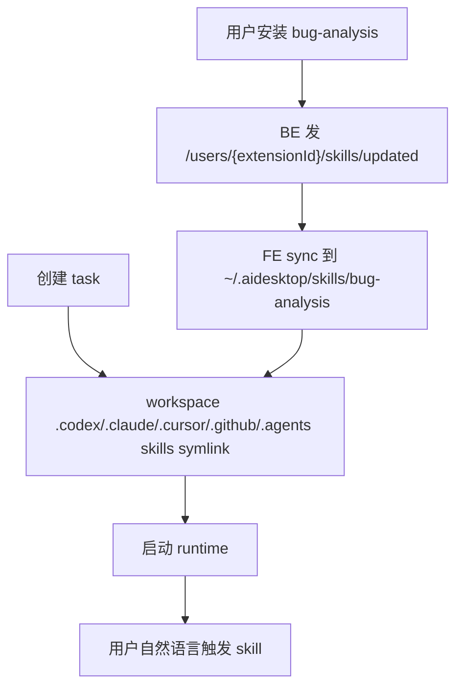

# 04 实现计划与验收

更新时间：2026-07-09

## 目标

按可交付顺序实现 AI Desk installed skills 的 native discovery：BE 提供 installed manifest / bundle / change event，FE 编排 sync，daemon 提供本机文件能力，task workspace 暴露 provider-native skills symlinks。

## 开发顺序

### 1. BE Installed Manifest API

新增：

```http
GET /api/v1/skills/installed-manifest
```

实现要求：

- 复用现有 persisted skills / installs 查询。
- 只返回当前用户 installed skills。
- 返回 `id`、`name`、`version`、`description`、`updatedAt`。
- skill 内容或 name 变化时，version 必须变化。
- 更新 OpenAPI / API types。

测试：

- installed-only result。
- 权限过滤。
- deleted / inaccessible skill 权限过滤。

### 2. BE Bundle Download API

新增：

```http
POST /api/v1/skills/installed-bundles:download
```

实现要求：

- request body：`{ ids: string[] }`。
- 只允许下载当前用户 installed skills。
- 返回完整 file tree。
- bundle 必须包含 `SKILL.md`。
- 复用现有 skill content -> `SKILL.md` fallback。
- 校验 file paths：no absolute path、no `..`、no path escape。
- 更新 OpenAPI / API types。

测试：

- bundle success。
- missing `SKILL.md` 时 fallback。
- unsafe path 被拒绝或过滤为受控错误。
- unauthorized / uninstalled id 返回受控错误。

### 3. BE Skills Updated Event

新增 event pattern：

```text
/users/~/skills/updated
```

实现要求：

- 在 `backend/app/events/pattern_registry.py` 注册，`params=["extensionId"]`，permission 使用 `settings:read`。
- 在 `POST /api/v1/events/subscriptions` 中对该 pattern 校验 `params.extensionId == current_user.rc_extension_id`。
- 现有 `POST /skills/{skillId}/install` 成功后 publish：
  - `type=install`
  - pattern resolved 为当前用户 `/users/{extensionId}/skills/updated`
- 现有 `DELETE /skills/{skillId}/install` 成功后 publish：
  - `type=uninstall`
  - pattern resolved 为当前用户 `/users/{extensionId}/skills/updated`
- 现有 `PUT /skills/{skillId}`、import sync、本地 sync 等 version update 成功后 publish：
  - `type=version`
  - 查询 `skill_installs` 中安装该 skill 的用户，逐个 publish `/users/{extensionId}/skills/updated`
- payload 包含 `type`、`skillId`、`version`、`emittedAt`。
- FE 收到后重新拉 `GET /skills/installed-manifest`。

测试：

- install publish。
- uninstall publish。
- version update publish。
- version update 只 publish 给安装该 skill 的用户。
- 未产生 version 更新的编辑不触发该事件。
- FE 订阅当前用户 `/users/{extensionId}/skills/updated` 后可收到事件。

### 4. MCP Skill Agent Instructions

修改：

- Python BE：`backend/app/services/skill_service.py` 中 `get_platform_entities(kind='skill')` 的 skill `agentInstructions`。
- Gleam BE：`backend_gleam/src/http/runtime_mcp_routes.gleam` 中同一 MCP response。

实现要求：

- 只调整 `kind='skill'` 的 instruction 文案。
- 保持 FE slash marker、Slash UI 和 prompt formatter 不变。
- 在现有 materialization cache/download instruction 之前插入 workspace native skill 优先级：
  - 先检查当前 workspace 的 provider skills directory：`.{agent}/skills`。
  - 如果存在同名 skill，使用 workspace skill cache，不下载 `materialization.archiveUrl`。
  - 如果不存在，继续执行 `materialization.targetDir` / `archiveUrl` 逻辑。
- 将原 materialization instruction 的开头从 `You MUST first check whether materialization.targetDir already exists` 改为 `If no workspace Skill cache exists, you MUST check whether materialization.targetDir already exists`。
- Python BE 与 Gleam BE response 保持一致。

测试：

- Python MCP skill response 包含 workspace native skill 优先 instruction。
- Gleam MCP skill response 包含 workspace native skill 优先 instruction。
- 现有 slash marker 字符串不变。

### 5. Daemon File API 扩展

复用已有：

- `GET /health`
- `POST /api/v1/file/read`
- `POST /api/v1/file/stat`

`file/stat` 用于 workspace symlink 前确认 `~/.aidesktop/skills` root。

新增：

```http
POST /api/v1/file/write-tree-batch
```

Request shape：

```json
{
  "root": "~/.aidesktop/skills",
  "writes": [
    {
      "relative_path": "bug-analysis",
      "replace": true,
      "files": {
        "SKILL.md": "..."
      }
    }
  ],
  "continue_on_error": true
}
```

要求：

- daemon 执行通用 batch file write。
- 内部复用现有 `writeFileTree(root, files, replace)` / `/file/write-tree` 语义。
- 所有 path 必须在 `root` 下，且 `root` 必须在 `allowed_working_dirs` 下。
- 所有 write path / file key 都必须是安全相对路径。
- `writes[].files` value 兼容现有 file tree 格式：可以是 string，也可以是 `{ "content": "...", "encoding": "base64" }`。
- 图片、二进制资源必须用 `{ content: base64, encoding: "base64" }`，daemon decode 后写成真实 binary 文件。
- local skill sync 的每个 write item 必须传 `replace=true`，替换整个 skill directory。
- `continue_on_error=true` 时尽可能写入其他 item，并返回 `written[]` / `failed[]`。
- 首轮 100 个 skills 通过一个 batch write 写入。

新增：

```http
POST /api/v1/file/delete-batch
```

要求：

- daemon 执行通用 batch file delete。
- `paths[]` 必须是 `root` 下安全相对路径。
- `recursive=true` 时允许删除目录树。
- `continue_on_error=true` 时尽可能删除其他 item，并返回 `deleted[]` / `failed[]`。
- 删除 missing path 返回 success item + `already_gone=true`。

复用已有：

- `POST /api/v1/file/symlink`

要求：

- FE 在调用前使用 `file/stat` 检查 link path。
- missing link 调 `/api/v1/file/symlink` 创建。
- existing directory 按 no-op。
- existing non-directory 返回 conflict。
- link path、target path 均受 daemon allowed dirs 校验。

测试：

- write-tree-batch writes 100 dirs in one request。
- write-tree-batch partial failure returns failed items。
- write-tree-batch forbidden outside allowed dirs。
- delete-batch deletes multiple stale dirs in one request。
- delete-batch partial failure returns failed items。
- delete-batch missing path returns already_gone。
- delete-batch forbidden outside allowed dirs。
- provider skills symlink missing -> create。
- provider skills symlink existing directory -> no-op。
- provider skills symlink existing file -> conflict。

### 6. FE Local Skill Sync Service

新增 service，例如：

```text
frontend/src/services/installedSkillLocalSync.ts
```

职责：

- 监听 daemon-ready startup trigger。
- 监听当前用户 `/users/{extensionId}/skills/updated` event。
- single-flight sync。
- 调 BE manifest API。
- 调 daemon file/read 读取 local manifest。
- normalize server `name` -> `dirName`。
- diff 生成 `writeSet` / `deleteSet` / no-op。
- 调 BE bundle download。
- 调 daemon write-tree-batch 批量写 skill dirs。
- 调 daemon delete-batch 批量删 stale dirs。
- 调 daemon file/write 写最终 `manifest.json`，manifest 中 `issues` 只记录 daemon 写入失败和删除失败；server manifest 为空时也写空 manifest，用于创建 `~/.aidesktop/skills` root。
- 记录 structured logs。

核心伪代码：

```ts
async function syncInstalledSkills(trigger: LocalSkillSyncTrigger) {
  return singleFlight.run(async () => {
    const server = await skillsApi.getInstalledManifest();
    const local = await readLocalManifestOrEmpty();
    const plan = buildSyncPlan(server, local);

    const bundles = await downloadBundles(plan.downloadIds);
    const writeResult = await daemon.writeTreeBatch(buildBatchWrites(plan, bundles));
    const deleteResult = await daemon.deleteBatch(plan.staleDirs);
    await writeLocalManifest(buildNextManifest(plan, writeResult, deleteResult, trigger));

    return plan.summary;
  });
}
```

测试：

- missing local manifest -> full sync。
- invalid local manifest -> full sync。
- write / delete / no-op。
- bundle download failure 保留当前 manifest。
- write-tree-batch partial failure 写入 manifest `issues`，成功项仍可记录。
- delete-batch partial failure 写入 manifest `issues`。
- manifest write failure 后下一轮可从文件状态重新收敛。

### 7. FE App Startup 接入

接入点：

- 使用现有 `DaemonContext` 的 `isAvailable` / `startupEpoch`。
- 当 `isAvailable=true` 且本轮 daemon startup epoch 未处理过，触发 `syncInstalledSkills('daemon_ready_startup')`。

测试：

- daemon unavailable 时不触发。
- daemon ready 后触发一次。
- daemon restart 后根据 `startupEpoch` 再触发。
- 并发 socket trigger 与 startup trigger 被 single-flight 合并。

### 8. FE Socket 接入

接入点：

- 使用现有 event bus / `useEventCallback` 订阅 `/users/~/skills/updated`，参数为当前登录用户 `extensionId`。
- 收到事件后触发 `syncInstalledSkills('skill_change_socket')`。

测试：

- 收到 install / uninstall / version 事件都触发 sync。
- 重复事件不造成并发 sync。
- socket payload stale 时仍以 manifest API 结果为准。

### 9. FE Task Workspace Symlink Ensure

接入点：

- FE task workspace preparation 阶段。
- 执行位置必须在 workspace 外层目录和 task project entry 准备完成之后、local runtime CLI 启动之前。
- 确认 `~/.aidesktop/skills` 存在；不存在时先触发 local sync。
- 对 workspace 外层依次 `file/stat`，missing 时调用 daemon `file/symlink`：
  - `.codex/skills`
  - `.claude/skills`
  - `.cursor/skills`
  - `.github/skills`
  - `.agents/skills`
- 不改变 task project entry 创建策略；无论 project entry 是 checkout 还是 symlink，provider skills symlink 都在 workspace 外层。
- local runtime CLI 启动 cwd 必须是 workspace 外层或等价 provider runtime root。

测试：

- missing link 创建。
- existing directory no-op。
- existing non-directory conflict 阻断 runtime start。

## 端到端验收



验收用例：

| Case | 验证 |
| --- | --- |
| daemon-ready startup sync | 启动 FE + daemon 后，本地生成 `~/.aidesktop/skills/manifest.json` 和 skill dirs。 |
| skill install | install 后收到 socket，新增 skill 被物化。 |
| skill update | version 变化后，新 bundle 替换旧目录，新 session 读取新内容。 |
| skill uninstall | uninstall 后旧目录通过 delete-batch 删除，manifest 移除 record。 |
| natural language named skill | 用户说“使用 bug-analysis 这个 skill”，runtime 能发现并使用。 |
| natural language intent skill | 用户说“帮我分析 bug”，runtime 可根据 description 选择 bug-analysis。 |
| skill-to-skill reference | `bug-analysis` 引用 `code-review` 时 runtime 能发现 `code-review`。 |
| workspace symlink | workspace 外层有 provider skills symlink。 |
| write/delete issue | write-tree-batch 或 delete-batch 部分失败时，manifest 记录失败项。 |

## 推荐验证命令

Frontend：

```bash
cd frontend && yarn typecheck
cd frontend && yarn test installed-skill-local-sync
cd frontend && yarn test workspace-skills-symlink
```

Python backend：

```bash
cd backend && pytest tests/test_skills_installed_manifest.py tests/test_skills_installed_bundles.py tests/test_skill_change_events.py
```

Daemon：

```bash
npm run test:daemon:go
```
