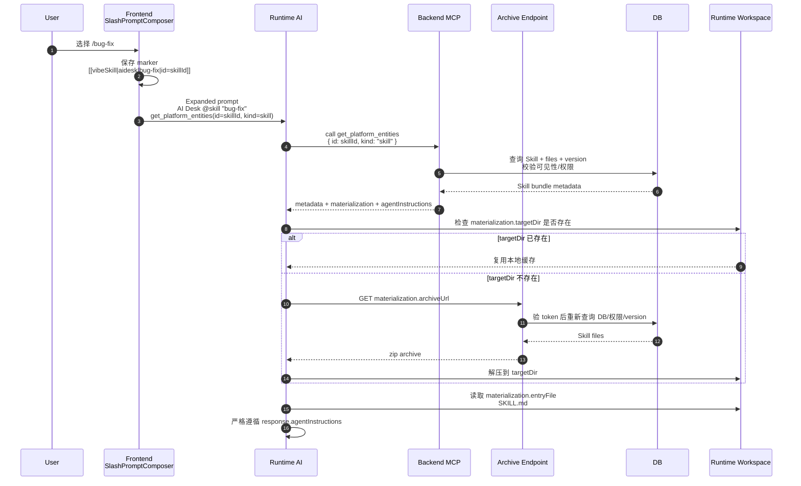
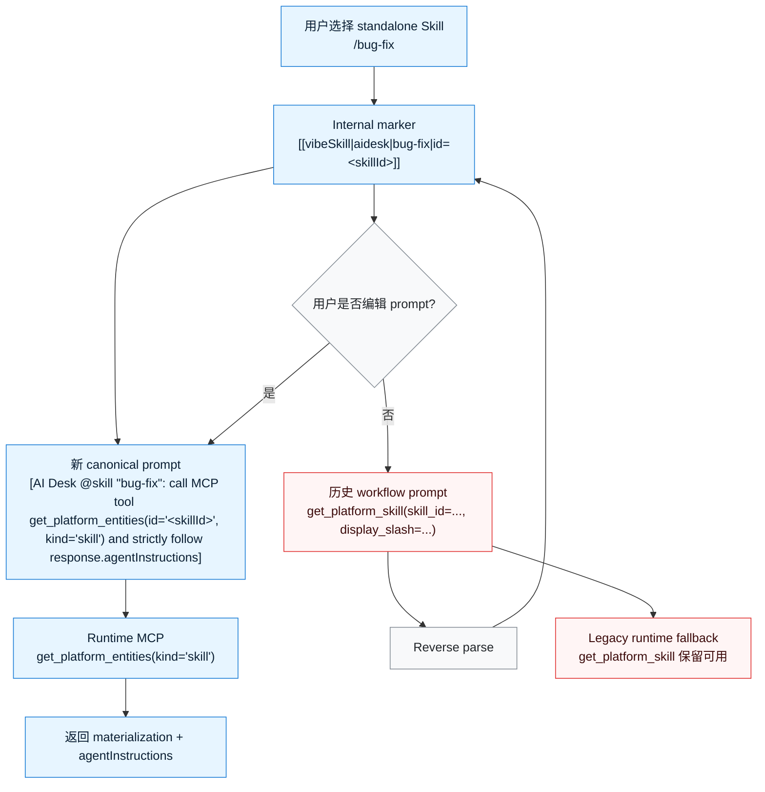

# Standalone Skill MCP Prompt 方案图

更新时间：2026-07-06

## 运行链路

## Prompt 与兼容策略

## 关键约定

- 新 prompt 只把 `id` 和 `kind` 作为 MCP 参数传给后端。
- `AI Desk @skill "bug-fix"` 中的 display name 只用于人读和前端反解，不参与后端 fallback。
- 独立 Skill 反解后仍使用 `vibeSkill` marker，不新增 `promptMention|skill`。
- 不做全局 save-time canonicalize；旧 workflow prompt 只有在用户编辑该 prompt 后才机会式迁移为新格式。
- `get_platform_skill` 不删除，继续服务历史 prompt。
