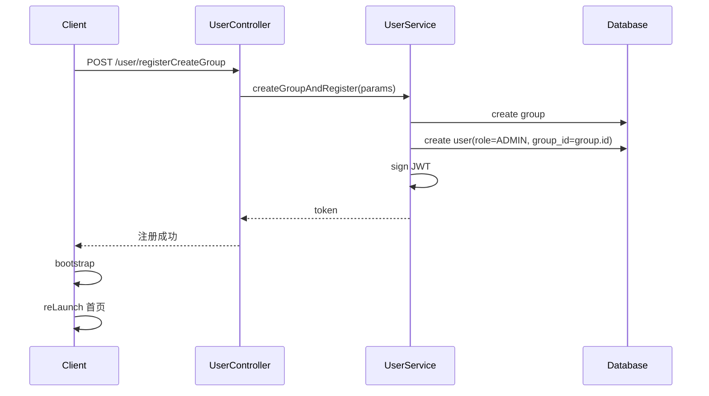
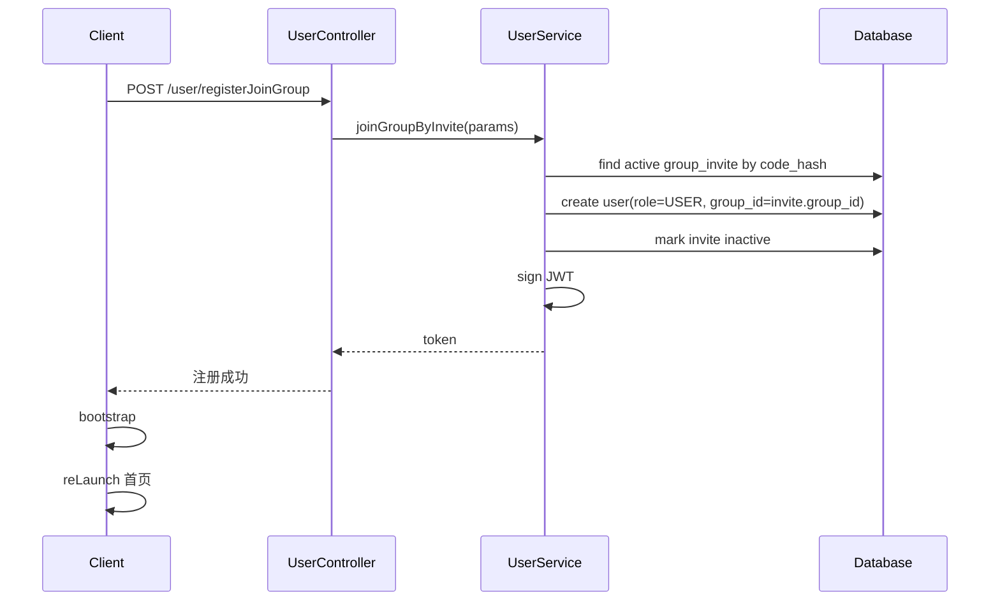

# 解决方案

## 核心思路

**注册流程先确定用户所属分组，人员管理流程再处理邀请和权限。**

- 注册页提供「创建分组」和「加入分组」两个模式。
- 创建分组会创建 `group` 和当前用户，当前用户为 `ADMIN`。
- 加入分组通过一次性邀请码完成，邀请码服务端映射到 `group_id`，当前用户为 `USER`。
- 管理员在「我的」页面进入人员管理，维护成员角色并生成邀请码。

## 技术栈

| 模块 | 技术 |
|------|------|
| 客户端 | Taro 4 + React 18 + TypeScript + SCSS Modules |
| 服务端 | Egg.js + TypeScript + Sequelize + MySQL |
| 登录态 | JWT token |
| 测试 | Jest、egg-bin test、现有手动小程序联调流程 |

## 常用命令

### 客户端

```bash
cd toy-taro-client
npm run dev:weapp
npm run build:weapp
npm run lint:eslint
npm test
```

### 服务端

```bash
cd toy-taro-server
npm run dev
npm run lint
npm run test-local
npm run tsc
npm run db:migrate
```

## 项目结构

```text
toy-taro-client/src/ui/pages/login/              登录页
toy-taro-client/src/ui/pages/register/           新增注册页
toy-taro-client/src/ui/pages/memberManage/       新增人员管理页
toy-taro-client/src/core/api/user.ts             用户、注册、人员管理 API
toy-taro-client/src/core/entity/user.ts          用户实体
toy-taro-client/src/core/model/user.ts           用户模型
toy-taro-client/src/ui/viewModel/user/           用户动作和用户信息 hooks
toy-taro-client/src/shared/utils/constants.ts    PAGE_ID 和角色常量
toy-taro-client/src/shared/utils/router.ts       页面路由映射
toy-taro-client/src/ui/container/configListPanel 管理列表容器，人员管理页优先复用
toy-taro-client/src/ui/components/statusView     loading 和 empty 状态，避免重复实现

toy-taro-server/database/group_invite.sql        新增邀请码表
toy-taro-server/database/migrations/             数据库迁移
toy-taro-server/app/model/groupInvite.ts         新增 Sequelize Model
toy-taro-server/app/controller/user.ts           注册、成员管理接口
toy-taro-server/app/service/User.ts              注册、邀请、权限业务逻辑
toy-taro-server/app/router.ts                    路由注册
```

## 前端复用和样式规范

### 复用优先级

新增注册页和人员管理页必须优先使用项目现有 UI 能力。

| 需求 | 复用对象 |
|------|----------|
| 页面背景和滚动容器 | `Layout`；注册页可复用登录页结构 |
| 管理列表 | `ConfigListPanel` |
| 加载和空状态 | `StatusWrapper`，或使用内置 `StatusWrapper` 的 `ConfigListPanel` |
| 弹层 | `FloatLayout` |
| 表单 | `FormItem`、`Input`、`PickerSelector` |
| 按钮 | `Button`，使用 `loading` 或 `icon='loading'` |
| 间距和安全区 | `WhiteSpace`、`SafeAreaBar` |

人员管理页不新建一套列表、loading、空状态和卡片样式。默认参考：

- `src/ui/pages/checkInManage/entrance/index.tsx`
- `src/ui/pages/prizeManage/entrance/index.tsx`
- `src/ui/pages/taskManage/categoryManage/index.tsx`

### 样式 token

SCSS 文件必须导入统一样式入口：

```scss
@import '@ui/styles/index.scss';
```

新增样式优先使用：

- 颜色：`$--color-red`、`$--text-color-base`、`$--text-color-secondary`、`$--fill-body`、`$--color-border-base`
- 渐变和背景：`$--gradient-*`、`@include soft-page-background`
- 卡片：`@include glass-card(...)`
- 间距和尺寸：`px(...)`
- TS 内联颜色：`COLOR_VARIABLES`

不应在页面 SCSS 中随意写死 `#e85aa6`、`rgba(...)` 阴影、背景色或圆角。如果现有 token 不足，先补充 token，再在页面使用。

## 数据模型设计

### group 表

复用现有 `group` 表。

```sql
CREATE TABLE IF NOT EXISTS `group` (
  `id` INT AUTO_INCREMENT PRIMARY KEY,
  `name` VARCHAR(255) COMMENT '群组名称',
  `create_time` TIMESTAMP DEFAULT CURRENT_TIMESTAMP COMMENT '创建时间'
) ENGINE=InnoDB DEFAULT CHARSET=utf8mb4 COLLATE=utf8mb4_unicode_ci COMMENT='群组表';
```

### user 表

复用现有 `user` 表。

关键字段：

| 字段 | 说明 |
|------|------|
| `open_id` | 微信用户唯一标识 |
| `username` | 账号密码登录用户名 |
| `password` | 账号密码登录密码 |
| `role` | `ADMIN` 或 `USER` |
| `group_id` | 用户所属分组 |

### group_invite 表

```sql
CREATE TABLE IF NOT EXISTS `group_invite` (
  `id` INT AUTO_INCREMENT PRIMARY KEY,
  `group_id` INT NOT NULL COMMENT '所属群组ID',
  `code_hash` VARCHAR(255) NOT NULL UNIQUE COMMENT '邀请码哈希',
  `created_by` INT NOT NULL COMMENT '创建人用户ID',
  `used_by` INT NULL COMMENT '使用人用户ID',
  `used_at` TIMESTAMP NULL COMMENT '使用时间',
  `is_active` TINYINT(1) DEFAULT 1 COMMENT '是否有效(0:否 1:是)',
  `create_time` TIMESTAMP DEFAULT CURRENT_TIMESTAMP COMMENT '创建时间',
  `last_modified_time` TIMESTAMP DEFAULT CURRENT_TIMESTAMP ON UPDATE CURRENT_TIMESTAMP COMMENT '最后修改时间',
  FOREIGN KEY (`group_id`) REFERENCES `group`(`id`),
  FOREIGN KEY (`created_by`) REFERENCES `user`(`id`),
  FOREIGN KEY (`used_by`) REFERENCES `user`(`id`)
) ENGINE=InnoDB DEFAULT CHARSET=utf8mb4 COLLATE=utf8mb4_unicode_ci COMMENT='群组邀请码表';
```

## 邀请码设计

邀请码使用服务端随机生成，不使用 `group_id` 加密或编码。

推荐格式：

```text
BANYA-8F6Q
```

生成逻辑：

1. 服务端生成随机码。
2. 对随机码进行规范化，例如去空格、转大写。
3. 计算 `sha256(normalizedCode + InviteSalt)`。
4. 将 hash 存入 `group_invite.code_hash`。
5. 将明文邀请码返回给管理员展示和复制。

使用逻辑：

1. 用户在注册页输入邀请码。
2. 服务端规范化输入值并计算 hash。
3. 查询有效邀请记录：`code_hash` 匹配且 `is_active = 1`。
4. 创建用户并绑定 `group_id`。
5. 将邀请记录标记为失效，记录 `used_by` 和 `used_at`。
6. 返回 token。

## 注册流程

### 创建分组



关键规则：

- 分组名必填。
- 当前用户不可已存在于其他分组。
- 创建成功后当前用户为 `ADMIN`。
- 注册接口返回 token，客户端直接进入首页。

### 加入分组



关键规则：

- 邀请码必填。
- 邀请码无效、已使用或不存在时返回明确错误。
- 加入成功后当前用户为 `USER`。
- 邀请码使用成功后失效。

## 人员管理流程

### 页面入口

在「我的」页面管理员菜单中新增：

| 菜单 | 可见条件 | 跳转 |
|------|----------|------|
| 人员管理 | `user.isAdmin` | `PAGE_ID.MEMBER_MANAGE` |

### 页面能力

人员管理页展示当前 `group` 下成员列表：

| 信息 | 说明 |
|------|------|
| 头像 | 使用现有用户头像逻辑 |
| 昵称/用户名 | 优先展示昵称，没有则展示默认名称 |
| 角色 | `ADMIN` 或 `USER` |
| 操作 | 管理员可调整角色 |

顶部或底部提供「生成邀请码」按钮。

生成成功后展示邀请码，支持复制：

```text
BANYA-8F6Q
```

## 后端接口设计

### 注册创建分组

```http
POST /user/registerCreateGroup
```

请求参数：

| 字段 | 类型 | 必填 | 说明 |
|------|------|------|------|
| `code` | string | 按登录方式 | 微信登录 code |
| `username` | string | 按登录方式 | 账号登录用户名 |
| `password` | string | 按登录方式 | 账号登录密码 |
| `groupName` | string | 是 | 分组名称 |

返回：

```typescript
{
  token: string;
}
```

### 注册加入分组

```http
POST /user/registerJoinGroup
```

请求参数：

| 字段 | 类型 | 必填 | 说明 |
|------|------|------|------|
| `code` | string | 按登录方式 | 微信登录 code |
| `username` | string | 按登录方式 | 账号登录用户名 |
| `password` | string | 按登录方式 | 账号登录密码 |
| `inviteCode` | string | 是 | 邀请码 |

返回：

```typescript
{
  token: string;
}
```

### 获取成员列表

```http
GET /user/getMemberList
```

权限：`ADMIN`

返回当前 `group_id` 下所有成员。

### 更新成员角色

```http
POST /user/updateMemberRole
```

权限：`ADMIN`

请求参数：

| 字段 | 类型 | 必填 | 说明 |
|------|------|------|------|
| `userId` | string | 是 | 目标用户 ID |
| `role` | `ADMIN` \| `USER` | 是 | 新角色 |

规则：

- 只能更新当前分组成员。
- 不能让当前分组失去最后一个 `ADMIN`。

### 生成邀请码

```http
POST /user/createGroupInvite
```

权限：`ADMIN`

返回：

```typescript
{
  inviteCode: string;
}
```

## 客户端设计

### 登录页

在现有登录页底部新增注册入口：

```text
还没有成长空间？创建或加入
```

点击进入注册页。

### 注册页

复用登录页视觉语言：

- 上半部分使用品牌图和伴芽文案。
- 下半部分使用玻璃面板。
- 面板内使用两个模式切换：「创建分组」「加入分组」。

创建分组模式：

- 标题：`创建成长空间`
- 说明：`为家人和孩子建立一个专属的任务、学习和奖励空间。`
- 表单：分组名称
- 主按钮：`创建并进入`

加入分组模式：

- 标题：`加入成长空间`
- 说明：`输入家人分享的邀请码，加入同一个成长空间。`
- 表单：邀请码
- 主按钮：`加入并进入`

### 人员管理页

页面结构参考已有管理页模式，优先使用 `ConfigListPanel`：

```text
人员管理
  ├── 成员列表
  │     ├── 成员头像
  │     ├── 成员昵称
  │     ├── 当前角色
  │     └── 角色切换
  └── 生成邀请码按钮
```

推荐实现形态：

```typescript
export default function () {
  const { scrollViewRefreshProps } = useSyncOnPageShow();
  const { memberList, loading, handleCreateInvite, handleUpdateRole } = useMemberManage();

  const renderContent = useCallback(
    ({ index }: { index: number }) => {
      const member = memberList[index];
      return <MemberItem member={member} onUpdateRole={handleUpdateRole} />;
    },
    [memberList, handleUpdateRole],
  );

  return (
    <ConfigListPanel
      title='人员管理'
      addButtonText='生成邀请码'
      list={memberList}
      loading={loading}
      loadingIgnoreCount
      renderContent={renderContent}
      scrollViewProps={scrollViewRefreshProps}
      onAdd={handleCreateInvite}
      editable={false}
      deletable={false}
    />
  );
}
```

说明：

- `ConfigListPanel` 内部已经使用 `StatusWrapper`，人员管理列表不需要自建 loading/empty UI。
- 若邀请生成弹窗或角色编辑弹窗需要展示异步状态，使用 `Button loading` 或已有 `StatusWrapper`。
- 成员项样式使用现有 token，角色标签使用 `$--color-red`、`$--color-accent-blue`、`$--text-color-secondary` 等变量，不写死颜色。

## 错误处理

| 场景 | 错误提示 |
|------|----------|
| 分组名为空 | 请输入分组名称 |
| 分组名重复 | 该分组名称已存在 |
| 邀请码为空 | 请输入邀请码 |
| 邀请码不存在或已失效 | 邀请码无效或已被使用 |
| 用户已注册 | 该账号已注册，请直接登录 |
| 非管理员访问 | 无权限操作 |
| 降级最后一个管理员 | 至少保留一名管理员 |
| 成员不属于当前分组 | 成员不存在或无权限操作 |

## 代码风格

遵循项目现有风格：

```typescript
export function useUserAction() {
  const [isActionLoading, setIsActionLoading] = useState(false);

  const handleRegisterCreateGroup = useCallback(
    async (params: { groupName: string }) => {
      try {
        setIsActionLoading(true);
        const { code } = await taroLogin();
        await sdk.modules.user.registerCreateGroup({ code, groupName: params.groupName });
        await bootstrap();
        navigateToPage({ pageName: PAGE_ID.HOME, isRelaunch: true });
      } finally {
        setIsActionLoading(false);
      }
    },
    [],
  );

  return {
    isActionLoading,
    handleRegisterCreateGroup,
  };
}
```

约定：

- 客户端 API 放在 `src/core/api/user.ts`。
- 用户动作放在 `src/ui/viewModel/user/useUserAction.ts`。
- 页面跳转使用 `navigateToPage`。
- 页面 UI 优先复用 `Layout`、`ConfigListPanel`、`StatusWrapper`、`FloatLayout`、`FormItem`、`Button`、`Input`。
- 新增 SCSS 使用 `@ui/styles/index.scss` 中的 token、`px()` 和 mixin，不直接写死颜色。
- 服务端业务逻辑优先放在 Service，Controller 只做参数和响应协调。
- 服务端角色校验必须在后端执行，不能只依赖前端隐藏入口。

## 测试策略

### 后端

- 邀请码生成格式和 hash 查询逻辑单元测试。
- 注册创建分组集成测试。
- 注册加入分组集成测试。
- 邀请码一次性使用测试。
- 成员角色更新权限测试。
- 最后一个管理员保护测试。

### 前端

- 注册页表单校验测试或手动验证。
- 人员管理页管理员入口显示验证。
- 邀请码生成、复制、使用后的状态验证。
- 登录页到注册页、注册成功到首页的跳转验证。

## 边界约束

### Always

- 所有人员管理接口都必须校验 `role = ADMIN`。
- 所有成员查询和更新都必须限定当前 `group_id`。
- 邀请码使用成功后必须失效。
- 注册成功后必须返回 token 并进入正常 bootstrap 流程。
- 数据库变更必须提供迁移脚本。
- 新增前端页面必须优先复用现有组件、容器、状态视图和主题 token。
- 人员管理页必须保持和「我的」页其他管理员入口页面一致的布局、loading、empty 和刷新行为。

### Ask first

- 是否支持账号密码注册和微信注册同时落地。
- 是否增加邀请码过期时间。
- 是否支持多次使用的邀请码。
- 是否允许管理员删除成员或移出分组。
- 是否需要新增设计 token 或修改共享组件能力。

### Never

- 不允许直接把 `group_id` 当邀请码展示给用户。
- 不允许前端传入 `role` 决定注册后角色。
- 不允许非管理员生成邀请码或调整成员权限。
- 不允许一个分组没有管理员。
- 不允许把邀请码明文持久化到数据库。
- 不允许为了人员管理页重新实现一套列表、loading、empty 状态或按钮体系。
- 不允许在新增页面中随意写死主题色、背景色、阴影色或圆角。

## 复用现有能力

| 能力 | 来源 | 用途 |
|------|------|------|
| 登录页品牌视觉 | `src/ui/pages/login` | 注册页视觉复用 |
| `ROLE` 枚举 | 服务端和客户端常量 | 成员权限判断 |
| `getContactList` | 用户接口和当前 group 查询逻辑 | 可扩展为成员列表 |
| `navigateToPage` | `shared/utils/router.ts` | 页面跳转 |
| `bootstrap` | `ui/bootstrap.ts` | 注册成功后的登录态初始化 |
| `withCustomTabBar` | 我的页面 | 保持人员管理入口体验一致 |
